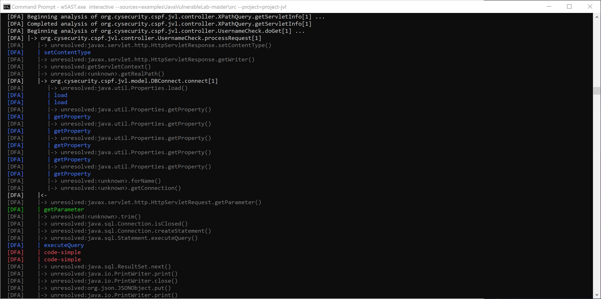

# wSAST Readme

## Features

The wSAST product contains the following major features:

* Dataflow Analyzer - wSAST is able to perform dataflow scans against the entire application assessed (assuming the languages used are supported); this includes cross-language analysis;
* Static Analyzer - wSAST is able to perform static analysis against the application syntax tree as expressed in WSIL;
* Code Graphing - wSAST can generate class relationship graphs, call graphs, local control flow graphs and ASTs for any part of the application (based on regex filters);
* Code Searching - wSAST can search the code for namespaces, classes, functions, variables based on regex;
* Call Listing - wSAST can graph calls to and from particular methods based on regex filters, as well as paths between calls matching two filters.

### Current Language Support

At the moment the following languages are supported or planned:

| Language | Version | Status |
| ---- | ---- | ---- |
| Java | 15 | Completed with a few minor exceptions |
| C | C11 | 90% but with some bugs to be fixed |
| Python | 2, 3 | Todo |
| Go |  | Todo |
| C++ | 14 | Parser completed; WSIL translator not written yet |
| C# | TBD | Todo |
| JavaScript | TBD | Todo |

Other languages will be added when development time is available.

### CWE Support

CWE support is slowly being added to the Common Rules Engine. Review the appropriate section of [Common Rules Engine](commonrules.md) for an up-to-date status.

### Platform Support

The core wSAST engine is written in C++ to be platform agnostic however the current release relies heavily on integration with .NET and a licensing library written for Windows only, so Windows is the only supported platform.

It is very unlikely that wSAST will run under Wine or other emulators. If the demand is high enough development may be considered for other platforms; it would need to be really high because the effort would subtract from time given to implementing new language support etc. It would likely come in the form of fixing wSAST to run under Wine.

## Using wSAST

The wSAST command line supports the following options:

```
  activate
    Activates the software for use.
      [activation-id] - The activation ID for the license
  dataflowscan
    Performs source-to-sink analysis of the specified sources; generates a report of results.
      <sources>       - Paths (comma separated) to scan for source files.
      <project>       - Name of project.
      [config]        - Path to wSAST configuration XML (default .\config.xml).
      [languages]     - Languages to scan (default: all).
  staticscan
    Perform static syntax tree analysis of the specified sources; generates a report of results.
      <sources>       - Paths (comma separated) to scan for source files.
      <project>       - Name of project.
      [config]        - Path to wSAST configuration XML (default .\config.xml).
      [languages]     - Languages to scan (default: all).
  interactive
    Perform interactive analysis of the specified sources.
      <sources>       - Paths (comma separated) to scan for source files.
      <project>       - Name of project.
      [config]        - Path to wSAST configuration XML (default .\config.xml).
      [languages]     - Languages to scan (default: all).
```

Each command receives a path to a list of comma separated folders containing source code, and a project name. To get started just point wSAST to a folder containing source code for one of the supported languages using one of the modes detailed above, for example `wSAST.exe interactive --sources=examples\JavaVulnerableLab-master --project=project-jvl`.

The **dataflowscan** runs a dataflow analysis scan without further prompting; the **staticscan** runs a static analysis scan without further prompting.

The **interactive** mode analyses the source code but results in an interactive terminal where the following commands can be used (listed by running **help**):

```
graph       Create graphviz DOT output from knowledge
    graph <type> [...]
        <type>          - classes, calls, local, ast
        [--filter=]     - comma separated regex of KDB entries (multiple means OR, ! prefix means AND NOT)
        [--inclusive]   - include only filtered types as destinations from matches
        [--highlight=]  - comma separated regex (multiple means OR, ! prefix meant AND NOT)
        [--entrypoints] - highlight entrypoints
        [--filename=]   - output file (in project directory)
        [--tokens]      - print tokens in graph labels (only: local)
        [--locs]        - print code filename and line/column info (only: ast)
kdbsearch   Search knowledge base entries
    kdbsearch <filter> [...]
        <filter>        - comma separated regex of KDB entries (multiple means OR, ! prefix means AND NOT)
        [types]         - [g]lobal, [n]amespace, [i]nterface, [cl]ass, [m]ethod, [co]nstructor, [b]lock, [v]ariable
astsearch    Search AST
    astsearch <filter> [...]
        <search>        - comma separated regex (multiple means OR, ! prefix means AND NOT)
        [types]         - [t]ype, [l]abel, [v]alue
        [--filter=]     - comma separated regex of KDB entries (multiple means OR, ! prefix means AND NOT)
calls       List calls to and from specific methods
    calls <direction> <path> [...]
        <direction>     - to, from
        <filter>        - comma separated regex of KDB method entries (multiple means OR, ! prefix means AND NOT)
        [--depth=]      - depth of calls to trace (default: 99999)
        [--locs=]       - number of surrounding lines of code to print (default 0)
paths       Find paths connecting functions
    paths <filter-start> <filter-end> [depth]
        <filter-start>  - comma separated regex of KDB entries (multiple means OR, ! prefix means AND NOT)
        <filter-end>    - comma separated regex of KDB entries (multiple means OR, ! prefix means AND NOT)
        [--depth=]      - depth of calls to trace (default: 99999)
        [--locs=]       - number of surrounding lines of code to print (default 0)
dfscan      Reload config and perform dataflow scan
sscan       Reload config and perform a static code scan
clear       Clear console.
exit        Exit to console.
```

The features above are fairly self explanatory and the best way to familiarise yourself with them is to experiment.

Since wSAST is designed to process fairly substantial amounts of code at runtime it is designed to output results for any of the above commands immediately as soon as they are identified. Any command can be cancelled by using `CTRL+C` as needed.

Where a `filter` is required (or optional) this takes the form of one or more comma separated regular expressions. Matching is inclusive unless prefixed with `!`, so `--filter=a,b,!c` will match both 'a' and 'b' but will exclude 'c'. The `highlight` parameter is the same as filter.

For graphs, the `--inclusive` switch means that every element of the graph must match the specified filter, rather than just the origin points. This means that if you graph all calls with filter `.*?foo.*` every call from a function with `foo` in the fully qualified name will be reported, including calls to `bar`. If `--inclusive` is set then all nodes must include `foo` within the name, so `bar` is no longer displayed howevercalls to  `foobar` are.

The `--tokens` switch for graphs can occasionally produce slightly unsightly code, since the tokens are obtained directly from the source file rather than from the parse tree (since only the WSIL tree is retained).

Running a dataflow or static scan when interactive results in unloading and reloading of the rule assemblies (such as the CommonRulesEngine.dll); this will lead to their own configurations being re-read (for example commonrules.xml). This means that new specific common rules for example can be added while interactive and the code re-scanned without re-loading wSAST.

### Dataflow Analysis

The main feature of wSAST is the Dataflow Analyzer which enables dataflow scan to be run against any application under assessment. To run dataflow analysis just run a command similar to `wSAST.exe dataflowscan --sources=examples\JavaVulnerableLab-master --project=project-jvl` pointing at the appropriate sources.

The sources, sinks and reporting subscriber plugins are read from config.xml; these implement specific interfaces enabling integration with wSAST (which will be covered in the developer documentation when available). The default plugin is the CommonRulesEngine.dll which exposes a simple approach to adding sources, sinks, static rules and generating outputs based on an XML rule format.



Dataflow analysis starts by generating a list of all entrypoints into the application and then analysing each in turn attempting to identify source-to-sink paths, reporting as it goes.

If code is missing or code flows are broken then analysis may traverse partial paths; this is especially true for asynchronous code which works based on events raised in framework code which may not be analysed. To handle these scenarios code can be augmented using WSIL to fill in the gaps.

#### Augmentation

It is possible to augment missing code using WSIL code which can then be included for analysis. For example, if a data model class was missing where it was known for example that calling the `model.setName()` method with a tainted name would taint the associated `model.getName()` method, a simple WSIL source file containing code similar to ...

```
class Model
{
	void setName(string name) { _name = name; }
	string getName() { return _name; }
	
	string _name;
}
```
... can be used to bridge the gap in analysis, enabling code to flow through seamlessly.

This code would need to be included in the list of sources analysed. By building up a list of shims for popular frameworks and classes this effort need not be repeated.

### Static Analysis

A secondary feature of wSAST is the Static Analyzer which enables in-place static scans to be performed against the WSIL tree for the entire application. To run static analysis just run a command similar to `wSAST.exe staticscan --sources=examples\JavaVulnerableLab-master --project=project-jvl` pointing at the appropriate sources.

The rules and subscriber plugins are read from config.xml; these implement specific interfaces enabling integration with wSAST (which will be covered in the developer documentation when available). The default plugin is the CommonRulesEngine.dll which exposes a simple approach to adding sources, sinks, static rules and generating outputs based on an XML rule format.


Static analysis processes every WSIL tree generated during code analysis, and prints methods and constructors as they are encountered and scanned but is not limited only to scanning these objects.

### Code Graphing

A feature of wSAST is the ability to generate code graphs of class relationships, calls graphs, local control flow graphs and AST graphs. Filterrs can be applied to reduce the scope of the graphs, and multiple filters can be chained together in a comma separated list of regex to display relationships between specific classes and methods graphically.


To generate call graphs run wSAST in `interactive` mode and use the `graph` command. To graph all calls with both "auth" and "sql" in the flow but not "sqlite" for example, you can run `graph calls --filter=.*?auth.*,.*?sql.*,!.*?sqlite.*`. Paths can be highlighted, so if you also wanted to draw attention to those containing the string "executeQuery" or "executeUpdate" you would add `--highlight=.*?execute(Query|Update).*`.

### Code Searching

The wSAST knowledge DB can be searched using the `kdbsearch` command. This takes a parameter and an optional type specifier. For example to list all methods with "doGet" in the name:

```
Command>  kdbsearch .*?doGet.* m
METHOD       org.cysecurity.cspf.jvl.controller.AddPage.doGet[1]
    C:\wsast\examples\JavaVulnerableLab-master\src\main\java\org\cysecurity\cspf\jvl\controller\AddPage.java (line 86)

METHOD       org.cysecurity.cspf.jvl.controller.EmailCheck.doGet[1]
    C:\wsast\examples\JavaVulnerableLab-master\src\main\java\org\cysecurity\cspf\jvl\controller\EmailCheck.java (line 78)

METHOD       org.cysecurity.cspf.jvl.controller.ForwardMe.doGet[1]
    C:\wsast\examples\JavaVulnerableLab-master\src\main\java\org\cysecurity\cspf\jvl\controller\ForwardMe.java (line 62)

METHOD       org.cysecurity.cspf.jvl.controller.Install.doGet[1]
    C:\wsast\examples\JavaVulnerableLab-master\src\main\java\org\cysecurity\cspf\jvl\controller\Install.java (line 196)

METHOD       org.cysecurity.cspf.jvl.controller.Logout.doGet[1]
    C:\wsast\examples\JavaVulnerableLab-master\src\main\java\org\cysecurity\cspf\jvl\controller\Logout.java (line 57)

METHOD       org.cysecurity.cspf.jvl.controller.Open.doGet[1]
    C:\wsast\examples\JavaVulnerableLab-master\src\main\java\org\cysecurity\cspf\jvl\controller\Open.java (line 61)

METHOD       org.cysecurity.cspf.jvl.controller.Register.doGet[1]
    C:\wsast\examples\JavaVulnerableLab-master\src\main\java\org\cysecurity\cspf\jvl\controller\Register.java (line 93)

METHOD       org.cysecurity.cspf.jvl.controller.SendMessage.doGet[1]
    C:\wsast\examples\JavaVulnerableLab-master\src\main\java\org\cysecurity\cspf\jvl\controller\SendMessage.java (line 82)

METHOD       org.cysecurity.cspf.jvl.controller.UsernameCheck.doGet[1]
    C:\wsast\examples\JavaVulnerableLab-master\src\main\java\org\cysecurity\cspf\jvl\controller\UsernameCheck.java (line 78)

METHOD       org.cysecurity.cspf.jvl.controller.XPathQuery.doGet[1]
    C:\wsast\examples\JavaVulnerableLab-master\src\main\java\org\cysecurity\cspf\jvl\controller\XPathQuery.java (line 85)

METHOD       org.cysecurity.cspf.jvl.controller.xxe.doGet[1]
    C:\wsast\examples\JavaVulnerableLab-master\src\main\java\org\cysecurity\cspf\jvl\controller\xxe.java (line 76)
```

A very useful feature of code search is the ability to find all calls to a particular method. For example to find all calls to the "executeQuery" method you would run `calls to .*?executeQuery.*`. The `--locs` parameter can specify the number of lines of code to include, to help reduce the effort required to filter out calls worth investigating:


Calls from particular methods can be listed the same way. Calls from a particular method require that the method code has been processed by wSAST.

Another extremely useful feature of wSAST is the ability to list paths between functions matching two regular expressions. The number of lines of code to print from the call destination can be specified. To list calls between the "doGet" method and "executeUpdate" method the query `paths .*?doGet.* .*?executeQuery.*` can be used:


### General Controls

The config.xml exposes simple controls to inform behaviour of the different analyzers. These are located at path `/wsast/config/general`:

**analysis**

| Field | Purpose | Usage |
| ---- | ---- | ---- |
| coe | Continue on error | Enables robust error handling in all aspects of analysis, continuing execution on errors at any level of analysis. This should generally be enabled. |

**dataflow**

| Field | Purpose | Usage |
| ---- | ---- | ---- |
| maxmem | Maximum memory usage | Fixes the amount of memory which can be used during analysis of a particular path before aborting analysis (and moving onto the next path). This is generally used only to prevent excessive paging and should match roughly the amount of memory available to the system, minus 3-4 GB. A value of 0 means no limit. |
| maxtime | Maximum time per path | Fixed the maximum runtime for evaluating a particular path. |
| maxthreads | Number of threads for analysis | Specifies how many concurrent threads to use for analysis (bear in mind each thread can use a fair amount of memory). The maxmem setting applies across all threads. |
| show-unresolved | Shows unresolved Paths | Applies during analysis, helping to see where code is missing during a scan. Missing code paths are greyed out. |
| unresolved-taint-logic | Unresolved code taint handling | Determines how unresolved code (missing classes, methods) should be treated during analysis. This is explained in more detail below. |

**dataflow/unresolved taint logic**

These settings apply **only to unresolved code**; for example if code for a class Foobar is missing then this will apply. If the code is present then it will not and analysis will treat the class based on its implementation.

This is a comma separated list of the following four options:

| Field | Purpose |
| ---- | ---- |
| data-members | This dictates that a tainted class data members should be considered to be tainted. For example, if an instance foo of class unresolved:Foobar is tainted, then foo.data is tainted (and the same sources are linked to it etc.). |
| method-members | This dictates that a tainted class method members should be considered to be tainted. For example, if an instance foo of class unresolved:Foobar is tainted, then the outputs of foo.func() are tainted (and the same sources are linked to it etc.). |
| func-outputs | This dictates that if inputs to a function are tainted then so are its outputs. |
| func-outputs | This dictates that if inputs to a class method are tainted then the underlying instance implementing it becomes tainted. |

**static**

| Field | Purpose | Usage |
| ---- | ---- | ---- |
| maxthreads | Number of threads for analysis | Specifies how many concurrent threads to use for analysis. |

Static analysis is much faster and much less memory intensive than dataflow analysis, so the other controls are not implemented for this mode.

## Support

For support please contact support@wsast.co.uk, or @wsastsupport on twitter.

If you want to follow me I will probably post about upcoming features and development progress @peterwintrsmith.

While wSAST is not yet at a major release version I don't intend to commercialise it, but once it reaches viability I will probably charge for commercial use to allow me to spend more time on development as at the moment it's an evening and weekend project.

I intend to always undercut other commercial code analysis tools, so I am thinking of a price range in the low $100s per year; the more sales I make the more time I will be able to spend working on it in the long run!
