# wSAST Users Guide
## Introduction
wSAST is a code analysis product which aims to assist security consultants in performing code reviews. It aims to become a swiss army knife of code analysis, empowering consultants to approach the task of code review with efficiency over compressed timescales. wSAST is designed to support any procedural (and optionally) object oriented language. At present only Java support has been implemented, but further work is underway to significantly expand the list of languages which wSAST is able to handle.

## Technical Overview
The wSAST analysis process is outlined by the following graphic:


The wSAST analysis process begins with parsing. The parser to use for each language is located by wSAST by examining the configuration XML looking for a supported language matching the extension of the source being being analysed. If a suitable parser is found then it is used to process the associated source code into a parse tree - the format of which is completely internal to the parser, and not the remit of wSAST. If parsing succeeds then the translation step implemented by the parser is invoked. The translation step is internal to the specific parser invoked and instructs the parser to convert the parse tree into an WSIL tree which can be processed by wSAST.

WSIL is a strongly typed language with a structure similar to Java defined by the grammar detailed in the section [Grammar](#grammar). It supports an array of programming language concepts including top-level code, namespaces, classes, interfaces, (multiple) inheritance, generics/template classes, dynamic variables, variable arguments, exception handlers, goto branching, and more.

WSIL can store references to the original parse tree in each AST node, enabling tokens to be sourced correctly when presenting code outputs. WSIL trees can support multiple alternate parses within each node to enable runtime disambiguation of certain constructs. WSIL AST nodes can also be arbitrarily annotated with data by the translator, allowing shortcoming in wSAST to be worked around by specific language processors and rules (one example of this is wSAST support for rules against annotations; WSIL does not support annotations natively but annotations can be added to the WSIL trees freely by the translator, enabling support to be added).

Once translation from a source file into a WSIL tree is completed then it is processed by wSAST to extract all code objects within the tree. This includes namespaces, classes, methods, variables and other key code objects. The knowledge base tracks information on the layout of the entire project and is frequently used by features of wSAST to query the source, both internally and by external plugins. An example of a simple knowledge base for a simple Java source file converted to WSIL follows:

```
GLOBAL
  NAMESPACE [paint] 
    NAMESPACE [canvas] 
      CLASS [GlassPanel]  ClassDeclaration-rule_1 [type paint.canvas.GlassPanel] [bases {unresolved:JPanel}] [implements unresolved:java.awt.event.MouseListener, unresolved:java.awt.event.MouseMotionListener, unresolved:java.io.Serializable]
        VARIABLE [drawHistory]  Identifier-rule_1 [type unresolved:ArrayList<PaintInfo>]
        VARIABLE [drawInfo]  Identifier-rule_1 [type unresolved:paint.model.PaintInfo]
        VARIABLE [canvas]  Identifier-rule_1 [type unresolved:PaintCanvas]
        CONSTRUCTOR [GlassPanel]  ConstructorDeclaration-rule_1 [type paint.canvas.GlassPanel]
          VARIABLE [drawHistory]  Identifier-rule_1 [type unresolved:ArrayList<PaintInfo>]
          VARIABLE [drawInfo]  Identifier-rule_1 [type unresolved:paint.model.PaintInfo]
          VARIABLE [canvas]  Identifier-rule_1 [type unresolved:PaintCanvas]
          BLOCK StatementBlock-rule_1
        METHOD [setTargetCanvas]  MethodDeclaration-rule_1 [type void]
          VARIABLE [canvas]  Identifier-rule_1 [type unresolved:PaintCanvas]
          BLOCK StatementBlock-rule_1
        METHOD [mouseReleased]  MethodDeclaration-rule_1 [type void]
          VARIABLE [e]  Identifier-rule_1 [type unresolved:java.awt.event.MouseEvent]
          BLOCK StatementBlock-rule_1
            BLOCK StatementBlock-rule_1
              BLOCK StatementBlock-rule_1
              BLOCK StatementBlock-rule_1
                BLOCK StatementBlock-rule_1
                  VARIABLE [tmp]  Identifier-rule_1 [type int32]
                BLOCK StatementBlock-rule_1
                  VARIABLE [tmp]  Identifier-rule_1 [type int32]
                VARIABLE [tmp]  Identifier-rule_1 [type unresolved:paint.model.PaintInfo]
                VARIABLE [Shape]  Identifier-rule_1 [type unresolved:ObjectiveShape]
        METHOD [mouseDragged]  MethodDeclaration-rule_1 [type void]
          VARIABLE [e]  Identifier-rule_1 [type unresolved:java.awt.event.MouseEvent]
          BLOCK StatementBlock-rule_1
            BLOCK StatementBlock-rule_1
```

In addition to extraction of code objects each code object is processed to determine what other code objects are visible to it. This includes tracking imported namespaces, classes and other types, and is important to allow wSAST to correctly implement searching of the knowledge base to locate visible objects in the presence of imported code and naming conflicts.

Once the knowledge base has been populated and scope information determined then the type analysis step is performed. Type analysis proceeds by processing every WSIL tree in the project recursively propagating type information associated with specific well defined data types, user defined classes, defined variables and parameters, method return values, etc. throughout expressions until no further type information is being deduced. Then the global control flow analysis proceeds, looking up visible methods by name and type from the perspective of the expression invoking them (using the knowledge base scope information) and connecting the WSIL tree node control flow information across nodes to repesent this information. Once this has been performed type analysis is performed once again to propagate any new information resulting from the associated method calls and return values. The type and global control flow analysis stages repeat until no further information is gained.

Once the type and global control flow analysis stages have completed local control flow analysis is performed across all code blocks within the knowledge base. This involves in assigning a basic block to each basic statement of the associated WSIL tree, classified as throwable or non-throwable, and recursively linking these basic blocks together from the inside out per the control flow statements such as if, switch, loops, try/catch, goto, etc. free code (blocks interspersed around type declarations) are also linked together, and so are initialisers. This essentially completes representing the code as a complete application.

To scan the source code for vulnerabilities two approaches are offered - dataflow analysis and static analysis.

Dataflow analysis is implemented as a lightweight interpreter for the WSIL language which traverses each possible code path within the application. Analysis proceeds by determining all entrypoints into the code which involves working back from each method using backrefs to determine callers, repeatedly and tracking recursive functions carefully, to determine a minimum set of code (functions and free code) with no more deeply nested callers.

Then each entrypoint is traced by the dataflow analyser. First context is created (surrounding class context, a this pointer, variables, method parameters, etc.) and then the local control flow graph is traversed link by link. Where branching occurs each branch is evaluated one after the other, then the results are unified and if necessary duplicate variables accounting for each path are stored in the local execution state. Where method calls are performed the process of setting up class and method context for the target method is performed and analysis proceeds. Return values are then merged into the caller's local state and paths through the target method merged. The process is repeated from the first node in the entrypoint graph to the last.

At each step (node to node) all registered sources and sinks are invoked, either before "execution" or afterwards, depending on the individual source/sink behaviour. A source or a sink can be tested against the AST they are invoked on, the broader containing AST, the local execution state, other variables and their associated sources and sinks matched so far, variable values and anything else that the dataflow analyser has access to at the time of invocation. Arbitrary data can be assigned to any variable through the source or sink which can be evaluated and updated at any point during "execution". Sources are attached to variables and have a lifetime associated with the variable, sinks are attached to local execution state and have a lifetime anchored to an arbitrary code object (specified by the sink).

Once a source and sink match occurs the sink is able to determine whether the match should be reported and if so it may invoke a subscriber to process the match. The subscriber receives the associated variables (and attached sources), sinks, and code path and may report the issue however it chooses (the default one just writes the code flow to file).

Static analysis is implemented as a simple tree walk which walks each WSIL tree within the project, invoking any registered static rules for each step of the descent. These rules have access to the AST they are invoked on and the broader tree but lack any sort of knowledge of execution state. These scans are much quicker and simpler than scans performed through dataflow analysis but lack context and are likely to generate more false positives.

Am effective approach to utilising both of these scan methods is to execute the static analysis first, then allow the dataflow analysis to proceed while manually reviewing the results from the static analysis.

To support both scan modes a Common Rules Engine has been implemented which allows the construction of rules for sources and sinks matching functions, variables and types, data patterns and annotations. These are discussed in more detail in the relevant sections of this document.

## Activation/Updates
After wSAST has been downloaded and extracted it needs to be activated; the activation process can be performed online or offline.

To activate online either just begin using wSAST and it will activate on first use using the key stored within the file `activation.id` or manually activate by running the command `wSAST.exe activate --activation-id=11111-11111-11111-11111-11111` where `11111-11111-11111-11111-11111` is the alpha activation ID. A successful activation should result in the creation of a `wsast_license.key` file which allows wSAST to run.

To activate offline run the command `wSAST.exe activate --activation-id=offline` and the a message similar to the following will be displayed:

```
[*] wSAST v0.1-alpha (release date 18-12-2023) (c) 2023 Peter Winter-Smith (@peterwintrsmith)
Licensed to: 0.1-alpha (Company: 0.1-alpha)
Expiration: 21-Apr-2024
To activate offline please contact support with the following information:
  Activation Key: <your-activation-id>
  Hardware ID: 1051-EF9E-D9A8-F4C3-4250-C752-7A8F-2A95
  Component IDs: 3FC6A5C45A77AF0C908E11C5C005C02FFDFDA9F588E7F8ABB0299DAEC8F15E78

Self-service offline activation is also possible; base64 decode and save the <key> field of the XML located at the following URL to 'wsast_license.key' within the same folder as wSAST.exe to activate:
  http://api.wsast.co.uk/api/0.1-alpha-18-12-2023/activate?key=<your-activation-id>&hwid=1051-EF9E-D9A8-F4C3-4250-C752-7A8F-2A95&cids=3FC6A5C45A77AF0C908E11C5C005C02FFDFDA9F588E7F8ABB0299DAEC8F15E78
```

The `key` parameter must be substituted for the activation ID (`11111-11111-11111-11111-11111` in the alpha release case) and the file at the URL produced can be accessed. The contents will be similar to:

```
<license>
<key>GVovlZFLVsxZqNUeGVdo8Wu08QqcGRPdETkOf6I+TmWFbFc+/qiIZnsEgjULl0RvDhW4cOjzTC8tfuKXTw5MsdnOeMRDeLMw+9Kdi7b0kD4W7S3O/cO466EoJQTnerbpFKDmN6kQU2PTajRQZBmwLYR+PUpTlG8BJ4RLLQM2bIgxcYb2nwQx4tX7Qg0uQ1CUDZIQ1sf3fhExPP0cIrwbxaJKB01fOYasjLZE3VJbkR/agpBA3uecOGD06P9MbGh2P92AFi8C+EzFv7304iHbTt+nuN+m33Q6aRw98/MUj32OaOISt1xjN8ir73VeKxpSbTH8bijMGdkshT+FswtK2yLxA1njhW4o8/7Nome+0TrWxtmT5mDEKkT03MDmviTtFwRR/6cbFBktbD4LrAYRdYL6z2leO0Fi9EyDYS7GBql/0UKdyYkptv95Umt2NI29mSDislzzQDkZgu47tJAl1xq4ANdQ2FX+F/9BugUIfpMAFZ2kaxVipcky+VfNsrBXRae8+NJ9rqKvIqdyIAPd3iKrqh/AXxipTADPs7so9381ZR9qvUnzy1qs1XieOSambxOzMOHYWejUU81KWtRAGxEiBdwILvGFHdw7U+0zTtot7wRlSzqJZxbHkEKLQfWw86gP4cPkCOZ3vxmdikKDder4/pm6ezKEgqpkjPp/vGkP53wKEl3kU0T8abp/OujmKN39uJJ9RzIL90jX5uNhZJocVxfTC4nuNvkqP6sD+l93ET3PBjpGkFCp6efKV6+YR0xS9M53ilQUKqIfwvq1Of/l1QmGtlLDwdk7rG+jCpCPkpy7O5MIIBUxnnCghkhkypPvHUZ+pdYGunHdlgWEXyNLH/h+3TdJh7eC5Qx/FgZT+N4N3lhPEoBVLHzC/tv5ohRGpa4mJJkoJRCh+GSqUh37LZM/TTAmtCbhlOprEcZyNlVD7deiBOnSvt1OPiz+n544JOOCc+RV/RZBFE/85qRNWdTf9qQX+7NXbv5kSy6TVffYFNOFlXuXcktDhWR/HTsguFR9DEv5Oz+2zF8tDAWHynioeKK03v8/xeBuQ2bGVHrvRB4XdHtD30JKUIy21L8KlIxH+0ArysptgneBSS+f6VWCGcsLLbaGdQBjgYt+JV+pTOKdNWT9PRWRE2yErI1jocyCqN8dV+CgDpPMIhYa3+Ks1YE1sfzJMegsfrsqaWHWIM8lWVXptVP+IjU35PZujKGuq66aZfrmMETCx+425pKAJq0jklb4Hy8shQ0sSsAUS1c2lcCierGg7hLRTS2n6vqUP015Ms4eqblmlT/wAVPv8YXsj15BX4qpBOGWrDKGFDCa0BtwzcHKMY3LcWo4B0fwTzmk4X/Wd8acNh0fW6w9Y6bXi1WRCB7j8ixMGsM27tG2tEF2hgz0qGMEki/nA1V7a09zmx8Cfhu2mnUtWM02cTxmv+I/z9u3JagqumF5eqqx1Ujz/LUg0XNVAbBisf3wvtvtVPWon1wnIDqN/vFk/6Sw7KDqHjI2SaNcnyfQs2ttGKvA0ovxBnTAG6VqxfeQ1ph9HBYGatzOqCKC0wElwGmXk/uYOVjJ4spSTSbPT1HmR3rY8CfPR005xvkjYkomIvlNowUXwlRuC3vOn4cb0wBqga8kzj1oH+12pfXh+b8b+s6eexwP3uxTWk8kWDKUBvSv7/ctDDgQyeA0x89Fdww8tZ6/FYsDtwhFHh1BzuhAZ3H5r89PJJDRN8h7pFZACdNVLMYAHQsNtogxqhDBkQYBBds8etGulgkuEy9b+pVBkIZubZ7gVdIfHVBVJ1mCgq68qNUMiTCyLiNfkD7yQPKKqgqFBRyf33BUUNIkh9mQXnwjUw4RqqIcLGWWy/usnXgkKqo2ve+3iiyr1hp4P4CJlugDO0wnYgxmXBQfDd7EyC2yLW5vtxgVy2tF5veXCRIW80+PUCpidNRQnAcUZjSMq6dj7ZFGqBtXS4oZu/KVmQA1utsbP2mybgPB3626EBNLiU/iU5V/GIPjEUIDffBBOQkMmyzhiQ9WgiO4mMWN2jnV9p1M/1AEOlxNg2JmNI2NNGZv3FbMAiWsKO6UWSbE6wvcZQ7n6C1tA4svzFy3ALy85/nG+u2g5bjjwS9y1Z+2gw7wslMe+qilP4uIiOjVb76Ry2pth3LAvSaqDx6Ln+lPLMibuNt5x/a3FP9uh4n+hxBKYFP1ahAjGrExL4IqVjDQTTPllloM57jujEH/jmjq8m/UI0QJZ49dLkkMYuB2yhi3hrkG9qmVbaC/zbpJ4Y4lhfvOxTioJX5HRKb3daVMedfGdCK901A3V3OZg3ZRxWe/aQhjvuj2xnYsyCXxZG3hUVIKAtLfzA0QIGYSw0fTa2VtEhlFCP7dmWnFoTqeYsl4WDPxJz9n+vGP6PSJv3YEIANYy3MydTlpaT9x3bzgvPoJo/bT2pHC8G5ZIDe77qDhjMQ2dLXxIp2iryfU8DxvgFiKx7hhlaXBEWHaqPQecAf+HkldiGsigRUSKa+q9sWapDPAdpoe62SN8+T9WduI4P5ENhOgADmTzRdyyc0bbiJXBUWhIGvo+V1xqu0f0mQPK17pj6pj+S6qrrDtxHAdn3/TGuorEf4+XgsRaiZBYHIVlWLgTNqW3+tCL9qZIA/4++oM1/BCqa6tkaoD7o65wUI4FEqpv7+P6VXPieRjJcZZF1FcebfU4JRH5in1YdY8AcrGgzzbeTEzQlOHKzFSenHTCl0hXyZ6zRY/aGzoK0wsDx3qekRh2/+8zRI42kqzh5mGpHNobK1pg4+BNdxhYIdNFp99U1lEUptd8O5Ld8NQmu6Ys5ZDwvEwyt1s+s0H2FsQvk6ZZLM4Zb1uoYwBcSyE495S/2hbeyWMZIa5gfNZu+cqhOqMLm95X5cQ5I3tnzy6oQbcL/FhboFZNVm7kkopHRiOuU2t21KEfruODtao+vHg</key>
<message level="success">Activation success!</message>
</license>
```

The `<key>` value should be base64 decoded and saved as `wsast_license.key` in same directory as `wSAST.exe`. Once this step has been completed wSAST should be ready for use.

The activation processes uses the [WinLicense](https://www.oreans.com/WinLicense.php) framework to implement licensing; some users have reported that the use of Themida by WinLicense triggers antivirus warnings. If this happens an exemption for the wSAST.exe executable may need to be configured. Please contact me at support@wsast.co.uk or @wsastsupport on Twitter with the name of the antivirus that triggers the warning and I will try to get the AV vendor to resolve the detection too.

## Operations
The wSAST application currently offers three main modes accessible from the command-line - these are: `dataflowscan`, `staticscan`, `interactive`.

The `dataflowscan` mode initiates a source-to-sink dataflow scan and is described in more detail within the [Dataflow Analysis](#dataflow-analysis) section; the `staticscan` mode initiates a static scan and is described in more detail within the [Static Analysis](#static-analysis) section.

The interactive mode allows inspection of the codebase to perform actions such as code graphing (class relationship, calls), to list calls to and from methods or classes, to list paths between methods or classes. This functionality is described in more detail in the [Code Inspection](#code-inspection) section.

## wSAST Configuration
The wSAST command line utility is driven by a configuration file stored by default in `config.xml` (although this can be changed by passing the `--config` parameter to the application). The configuration file appears as follows:

```
<?xml version="1.0" encoding="utf-8" ?>
<wsast>
	<config>
		<languages>
			<!-- implements WsilHelper.Interfaces.Language interface to expose a parser -->
			<language name="wsil" extensions="wsil" assembly="WsilHelper, Version=1.0.0.0, Culture=neutral, PublicKeyToken=null" class="WsilHelper.WsilParser" maxthreads="8" tolerant="false" />
			<!--language name="c" extensions="c" assembly="AntlrCsC.dll" class="AntlrCsC.AntlrCParser" maxthreads="1" tolerant="false" /-->
			<language name="java" extensions="java, jsp" assembly="JavaHelper.dll" class="JavaHelper.JavaParser" maxthreads="8" tolerant="false" timeout="120" />
		</languages>
		<sources>
			<!-- implements WsilHelper.Interfaces.Source interface to expose a source -->
			<source languages="wsil, c, java" name="simplefunction" assembly="CommonRulesEngine.dll" class="CommonRulesEngine.SimpleFunction.SimpleFunctionSources" />
			<source languages="wsil, c, java" name="simplevariable" assembly="CommonRulesEngine.dll" class="CommonRulesEngine.SimpleVariable.SimpleVariableSources" />
			<source languages="wsil, c, java" name="simpledata" assembly="CommonRulesEngine.dll" class="CommonRulesEngine.SimpleData.SimpleDataSources" />
			<source languages="wsil, c, java" name="simpleannotation" assembly="CommonRulesEngine.dll" class="CommonRulesEngine.SimpleAnnotation.SimpleAnnotationSources" />
		</sources>
		<sinks>
			<!-- implements WsilHelper.Interfaces.Sink interface to expose a sink -->
			<sink languages="wsil, c, java" name="simplefunction" assembly="CommonRulesEngine.dll" class="CommonRulesEngine.SimpleFunction.SimpleFunctionSinks" />
			<sink languages="wsil, c, java" name="simplevariable" assembly="CommonRulesEngine.dll" class="CommonRulesEngine.SimpleVariable.SimpleVariableSinks" />
			<sink languages="wsil, c, java" name="simpledata" assembly="CommonRulesEngine.dll" class="CommonRulesEngine.SimpleData.SimpleDataSinks" />
			<sink languages="wsil, c, java" name="simplesyntactic" assembly="CommonRulesEngine.dll" class="CommonRulesEngine.SimpleSyntactic.SimpleSyntacticRuleProvider" />
		</sinks>
		<static>
			<!-- implements WsilHelper.Interfaces.Static interface to expose a static rule -->
			<static-rule languages="wsil, c, java" name="simplefunction" assembly="CommonRulesEngine.dll" class="CommonRulesEngine.SimpleFunction.SimpleFunctionStaticRules" />
			<static-rule languages="wsil, c, java" name="simplevariable" assembly="CommonRulesEngine.dll" class="CommonRulesEngine.SimpleVariable.SimpleVariableStaticRules" />
			<static-rule languages="wsil, c, java" name="simpledata" assembly="CommonRulesEngine.dll" class="CommonRulesEngine.SimpleData.SimpleDataStaticRules" />
			<static-rule languages="wsil, c, java" name="simplesyntactic" assembly="CommonRulesEngine.dll" class="CommonRulesEngine.SimpleSyntactic.SimpleSyntacticRuleProvider" />
		</static>
		<subscribers>
			<!-- implements WsilHelper.Interfaces.Subscriber interface to expose a subscriber -->
			<subscriber languages="wsil, c, java" name="simplesubs" assembly="CommonRulesEngine.dll" class="CommonRulesEngine.SimpleSubscribers" />
		</subscribers>
		<static-results>
			<!-- implements WsilHelper.Interfaces.StaticResultSubscriber interface to expose a subscriber -->
			<subscriber languages="wsil, c, java" name="simplesubs" assembly="CommonRulesEngine.dll" class="CommonRulesEngine.SimpleStaticResultSubscribers" />
		</static-results>
		<general>
			<analysis coe="true" />
			<dataflow maxmem="90%" maxtime="0" maxthreads="6" max-vars="500" show-unresolved="true" unresolved-taint-logic="data-members, method-members, func-outputs, func-taints-instance" shortciruit-repeated-calls="true" />
			<static maxthreads="16" />
		</general>
	</config>
</wsast>
```

The `languages` section lists all language plugins that will be used by wSAST; during source importation only files which have a file extension matching one of the language `extensions` fields are processed. The `assembly` and `class` specify where the language code resides and reflection is used to load the provider. Languages implement an `ILanguageProvider` interface and must build WSIL trees trees using the `WrappedWsilNodeBuilder` class but can otherwise be implemented using any parsing framework.

The `sources` section lists all sources used for source-to-sink dataflow analysis. The `assembly` and `class` specify where the source code resides and reflection is used to load the provider. The sources implement an `ISource` interface which implements source logic and the specified `class` implements an `ISourceProvider` which returns instances of all sources implemented by the class.

The `sinks` section lists all sinks used for source-to-sink dataflow analysis; the behaviour is identical to `sources` except for sink providers and implement `ISink` and `ISinkProvider` interfaces respectively.

The `static` section lists all static rules used for static analysis; these are not used for dataflow analysis. These rules implement an `IStaticRule` interface, and the `class` provider specified implements an `IStaticRuleProvider` interface.

The `subscribers` section lists all subscribers used for reporting source-to-sink results; these implement an `ISubscriber` interface and the `class` providers specified implements an `ISubscriberProvider` interface.

The `static-results` section lists all subscribers used for reporting source-to-sink results; these implement an `IStaticRuleResult` interface and the `class` providers specified implements an `IStaticRuleProvider` interface.

The `general` section lists various controls which can be configured to help analysis succeed. These generally don't need to be configured for simple projects but for complex projects with many source files some finetuning of these variables can help improve the odds of success/complete dataflow analysis.

The `analysis` tag `coe` setting specifies whether the analysis phases should attempt to recover from any errors which occur; these errors may occur due to errors in translation from parsed source to to WSIL, or due to bugs/edge-cases in the wSAST engine. There is generally no reason not to set this value to `true`.

The `dataflow` tag contains controls related to the dataflow analyzer. The `maxmem` setting controls the amount of memory that the dataflow analyser is allowed to consume (as a percentage of available RAM at the time of the scan) when walking a code path. Once exceeded the thread which is consuming the most memory is aborted and analysis continues from the next path. The `maxtime` setting behaves similarly but with respect to the runtime allowed per code path. A value of 0 removes all limits and will consume as much memory as available and then page if necessary.

The `max-vars` setting controls an internal value which dictates how many intermediate variables are allowed when following expressions. For example, when an expression like the following is encountered, since the `password` and `username` variables are in this case traced a large number of traced intermediate variables can be generated:

```
// code from Nebulake-main\src\users\UsersServlet.java

if (password.length() > 8 && !password.contains("abc") && !password.contains("123") && !password.contains("password")
		&& username.length() > 1 && !username.contains("!") && !username.contains("@") && !username.contains("#") && !username.contains("$") && !username.contains("%") && !username.contains("^") && !username.contains("&") && !username.contains("*") && !username.contains(">") && !username.contains("<") && !username.contains(":")
		&& !username.contains("(") && !username.contains(")") && !username.contains("-") && !username.contains("+") && !username.contains("=") && !username.contains("`") && !username.contains("~") && !username.contains(".") && !username.contains(",") && !username.contains(":") && !username.contains(";")
	) {        	       	
	validPassword = true;
}
```

The `max-vars` setting in this case ensures only a random selection of intermediate variables produced (up to the number specified) are evaluated for this expression.

The `show-unresolved` setting is used to dictate whether calls to unresolved methods are printed to screen during a dataflow scan.

The `unresolved-taint-logic` specifies how tracing interactions with unresolved methods and types should be considered during analysis; enabling these can make analysis more robust when it comes to tracing through missing code and generally they should be left enabled unless all source within a project and its dependencies are provided.

Roughly speaking the values have the following meanings: `data-members` - if an unresolved instance is tainted its members are tainted; `method-members` - if an unresolved instance is tainted then its method outputs are tainted; `func-outputs` - if an unresolved function inputs are tainted then so are its outputs; and `func-taints-instance` - if inputs to an unresolved member function are tainted then the underlying instance is tainted.

The `shortciruit-repeated-calls` specifies whether repeated function calls with an identical state (except for execution path) should be skipped and the result from previous called used; this can greatly speed up analysis of functions which repeatedly call functions with the same parameters without any new state changes occurring.

The `static` tag contains controls related to the static analyzer. The `maxthreads` setting specifies how many threads static analysis should use. This can generally be set to a higher value than for the dataflow analysis thread count because it consumes much less memory and CPU when executing.

For more information on how custom sources, sinks, static rules and subscribers can be implemented please refer to the [wSAST Developer Guide](devguide.md).

For more information on the `general` controls for wSAST see the [General Controls](readme.md#general-controls) section of the readme file.

## Starting a Project
To use wSAST to start a new project generally the `interactive` mode is the best mode to use, since it will enable saving of the project to file which can help speed up analysis if wSAST is analysis is re-run after the application has been closed.

An example command line to start a new project is `wSAST.exe interactive --sources=..\examples\Voice_Banking_App-master --project=vba`. This should produce an output similar to:

```
[*] wSAST v0.1-alpha (release date 18-12-2023) (c) 2023 Peter Winter-Smith (@peterwintrsmith)
Licensed to: 0.1-alpha (Company: 0.1-alpha)
Expiration: 21-Apr-2024
Latest News:
  17-07-2023 | First release of wSAST in alpha build. For support please contact support@wsast.co.uk. I hope you find it useful!
Loaded configuration from 'config.xml'
Including code in '..\examples\Voice_Banking_App-master'
Created project 'vba' at 'C:\wsast\latest\vba'
[*] No languages specified - using all defined
Using language 'wsil' with extensions '.wsil'
Using language 'java' with extensions '.java', '.jsp'
Loading language 'wsil' from assembly 'WsilHelper, Version=1.0.0.0, Culture=neutral, PublicKeyToken=null' ...
Loading language 'java' from assembly 'JavaHelper.dll' ...
Parsing 0 files in total for language 'wsil'
[*] [wsil] Parse beginning ...
[+] [wsil] All files completed.
Parsing 77 files in total for language 'java'
  [java] [C:\wsast\examples\Voice_Banking_App-master\build\generated-sources\ap-source-output\za\ac\tut\entities\Account_.java]
  [java] [C:\wsast\examples\Voice_Banking_App-master\build\generated\src\org\apache\jsp\authentication_jsp.java]
  [java] [C:\wsast\examples\Voice_Banking_App-master\build\generated\src\org\apache\jsp\insufficientamount_jsp.java]
...
  [java] [C:\wsast\examples\Voice_Banking_App-master\src\java\za\ac\tut\business\AccountFacadeLocal.java]
Performing semantic analysis of discovered code ...
  Performing type analysis  ...
  Performing control flow analysis ...
[+]   Semantic analysis completed.
Semantic analysis took 00:00:00.3724727
Do you wish to save the analysed project to disk? [y/n]>  y
Saving project to file 'C:\wsast\latest\vba\project.wsast' ...
Saved (file size 107,874)
A total of 107 entrypoints found
Entrypoints written to file 'C:\wsast\latest\vba\entrypoints.txt'
Knowledge DB written to file 'C:\wsast\latest\vba\knowledgedb.txt'
[*] Interactive code analysis mode
Command>
```

If an existing project with the same name is found wSAST will prompt to overwrite, and wSAST will also prompt to save the project once analysis is completed (the file `project.wsast` is created within the project directory).

Once analysis is completed the `Command>` prompt will display. This prompt can be used to generate graphs, find calls to and from specific functions, paths between functions and initiate dataflow scans and static scans. An advantage to starting scans from the interactive mode is that because the `config.xml` sources, sinks, subscribers and static rules are reloaded allowing scan criteria to be modified (for example, new XML-based rules to be added to the Common Rules Engine) without having to redo analysis as would be required if running a scan from the command line directly.

The `help` command displays a summary of the interactive capabilities:

```
Command>  help

graph       Create graphviz DOT output from knowledge
    graph <type> [...]
        <type>          - classes, calls, local, ast
        [--filter=]     - comma separated regex of KDB entries (multiple means OR, ! prefix means AND NOT)
        [--inclusive]   - specifies that either source OR destination of a link can match filter
        [--filter-root] - filter applies only to root code object (only: calls)
        [--highlight=]  - comma separated regex (multiple means OR, ! prefix meant AND NOT)
        [--entrypoints] - highlight entrypoints
        [--filename=]   - output file (in project directory)
        [--tokens]      - print tokens in graph labels (warning: this can be inaccurate for languages other than WSIL) (only: local)
        [--locs]        - print code filename and line/column info (only: ast)
        [--ignorecase]  - filters are case insensitive
kdbsearch   Search knowledge base entries
    kdbsearch <filter> [...]
        <filter>        - comma separated regex of KDB entries (multiple means OR, ! prefix means AND NOT)
        [types]         - [g]lobal, [n]amespace, [i]nterface, [cl]ass, [m]ethod, [co]nstructor, [b]lock, [v]ariable
        [--ignorecase]  - filters are case insensitive
astsearch    Search AST
    astsearch <filter> [...]
        <filter>        - comma separated regex (multiple means OR, ! prefix means AND NOT)
        [types]         - [t]ype, [l]abel, [v]alue
        [--filter=]     - comma separated regex of KDB entries (multiple means OR, ! prefix means AND NOT)
        [--ignorecase]  - filters are case insensitive
calls       List calls to and from specific methods
    calls <direction> <path> [...]
        <direction>     - to, from
        <filter>        - comma separated regex of KDB method entries (multiple means OR, ! prefix means AND NOT)
        [--depth=]      - depth of calls to trace (default: 99999)
        [--locs=]       - number of surrounding lines of code to print (default 0)
        [--ignorecase]  - filters are case insensitive
paths       Find paths connecting functions
    paths <filter-start> <filter-end> [depth]
        <filter-start>  - comma separated regex of KDB entries (multiple means OR, ! prefix means AND NOT)
        <filter-end>    - comma separated regex of KDB entries (multiple means OR, ! prefix means AND NOT)
        [--depth=]      - depth of calls to trace (default: 99999)
        [--locs=]       - number of surrounding lines of code to print (default 0)
        [--ignorecase]  - filters are case insensitive
dfscan      Reload config and perform dataflow scan
        [--filter=]     - comma separated regex of KDB entries (multiple means OR, ! prefix means AND NOT)
sscan       Reload config and perform a static code scan
        [--filter=]     - comma separated regex of KDB entries (multiple means OR, ! prefix means AND NOT)
clear       Clear console.
exit        Exit to console.

Command>                                                                                                                           
```

## Resuming a Project
If running  `interactive` mode it is possible to resume projects which have been previously created. To do this it is necessary to supply the name of the project as previously saved as the `--project` parameter, and the original source code should also be supplied as the `--sources` parameter to enable it to be read for the purpose of reporting issues or generating graphs. Confirm loading the project from file when prompted:

```
C:\wsast\latest>wSAST.exe interactive --sources=..\examples\Voice_Banking_App-master --project=vba
[*] wSAST v0.1-alpha (release date 18-12-2023) (c) 2023 Peter Winter-Smith (@peterwintrsmith)
Licensed to: 0.1-alpha (Company: 0.1-alpha)
Expiration: 21-Apr-2024
Latest News:
  17-07-2023 | First release of wSAST in alpha build. For support please contact support@wsast.co.uk. I hope you find it useful!
Loaded configuration from 'config.xml'
Including code in '..\examples\Voice_Banking_App-master'
[-] Project vba at 'C:\wsast\latest\vba' already exists.
Created project 'vba' at 'C:\wsast\latest\vba'
[*] No languages specified - using all defined
Using language 'wsil' with extensions '.wsil'
Using language 'java' with extensions '.java', '.jsp'
Loading language 'wsil' from assembly 'WsilHelper, Version=1.0.0.0, Culture=neutral, PublicKeyToken=null' ...
Loading language 'java' from assembly 'JavaHelper.dll' ...
Project file 'C:\wsast\latest\vba\project.wsast' exists
Load project from file? [y/n]>  y
[-] File is 107,874 bytes - this may take a while ...
Loaded 77 source trees from project file ...
  [java] Restored: C:\wsast\examples\Voice_Banking_App-master\build\generated-sources\ap-source-output\za\ac\tut\entities\Account_.java
  [java] Restored: C:\wsast\examples\Voice_Banking_App-master\build\generated\src\org\apache\jsp\authentication_jsp.java
...
  [java] Restored: C:\wsast\examples\Voice_Banking_App-master\src\java\za\ac\tut\business\AccountFacadeLocal.java
Performing semantic analysis of discovered code ...
  Performing type analysis  ...
  Performing control flow analysis ...
[+]   Semantic analysis completed.
Semantic analysis took 00:00:00.2862342
A total of 107 entrypoints found
Entrypoints written to file 'C:\wsast\latest\vba\entrypoints.txt'
Knowledge DB written to file 'C:\wsast\latest\vba\knowledgedb.txt'
[*] Interactive code analysis mode
Command>
```

## Code Inspection
In interactive mode the following core capabilities are offered by wSAST: code graphing, code searching, listing of calls to and from classes and methods, and listing of calls between classes and methods. For graphs created using these features the output is a GraphViz DOT file which can be viewed with any suitable viewer.

### Graphing Class Relations
To graph class relationships the `graph classes` feature can be used from the interactive command line. Running this command with no additional parameters will graph class relationships between all classes within the code analysed.

A class relationship link is established from any usage of one class by another, for example if class `Foo` has a member variable, local variable, method parameter, makes a method call to, or in any other way interacts with an instance of type `Bar` then a link is established:

```
Command>  graph classes
[+] Class relationship graph written to file 'C:\wsast\latest\vba\graphs\classes.dot'
```

Running `graph classes` will include links to unresolved classes (ones for which source was not included); this can result in a graph which is extremely large and messy because it will include all references to language runtime types which are not resolved and the relationships between these types and project code will be frequent and dense (in the current example 370 lines of graphviz output):

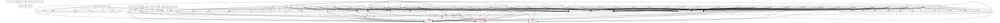

Running `graph classes` with a filter to remove unresolved types can provide a much more legible graph:

```
Command>  graph classes --filter=!unresolved.*
[+] Class relationship graph written to file 'C:\wsast\latest\vba\graphs\classes.dot'
```

In the above command the `--filter` regex starting with `!` instructs the graphing engine to omit any matches for the regex:


Once the long tail of classes with no references is removed from the graphviz DOT output the image appears below:

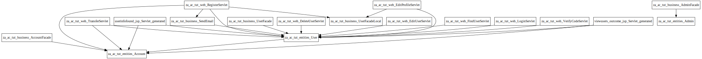

This more clearly shows how the classes within the application are inter-related.

To highlight specific classes of interest the `--highlight` filter can be used:

```
Command>  graph classes --filter=!unresolved.* --highlight=.*?User.*,.*?Admin.*,.*?Register.*
[+] Class relationship graph written to file 'C:\wsast\latest\vba\graphs\classes.dot'
```

This will generate the same graph but with colouring for boxes which match one of the filters; the colours are different for each matched expression:

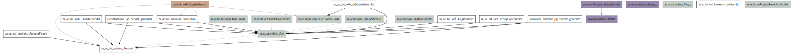

These types of graphs can be a good way to get an initial handle on a codebase and how it is divided up by major areas of functionality, and how they interrelate.

### Graphing Code Flow
To graph code flow across function calls the `graph calls` feature can be used from the interactive command line. Running this command with no additional parameters will graph all calls between all functions and code blocks within the code analysed.

The call graph contains all calls between all code analysed. For example, if function `foo()` calls function `bar()` then a link between bar and foo will be established. If `foobar()` calls `bar()` then there will be two links to bar, and if `bar()` calls `foo()` there will be a cycle.

```
Command>  graph calls
[+] Call graph written to file 'C:\wsast\latest\vba\graphs\calls.dot'
```

Running `graph calls` will include calls to unresolved functions although these unresolved functions will not call any further functions as they cannot be analysed. Functions which are called from many places have the potential to greatly increase the complexity of the graph (654 lines of graphviz output):

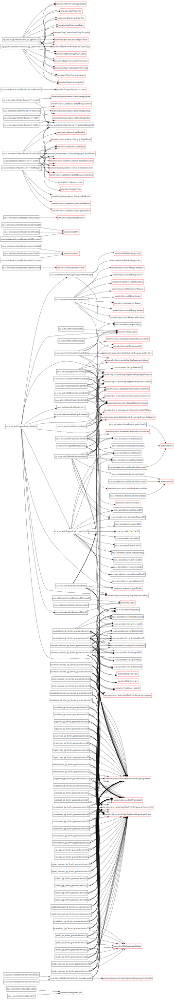

The call graphs are laid out from left to right which makes the code flow a little easier to follow than the layout type used when graphing classes.

Running `graph calls` with a filter to remove unresolved methods can provide a much more legible graph (now 141 lines of graphviz output):

```
Command>  graph calls --filter=!unresolved.*
[+] Class relationship graph written to file 'C:\wsast\latest\vba\graphs\calls.dot'
```

In the above command the `--filter` regex starting with `!` instructs the graphing engine to omit any matches for the regex:

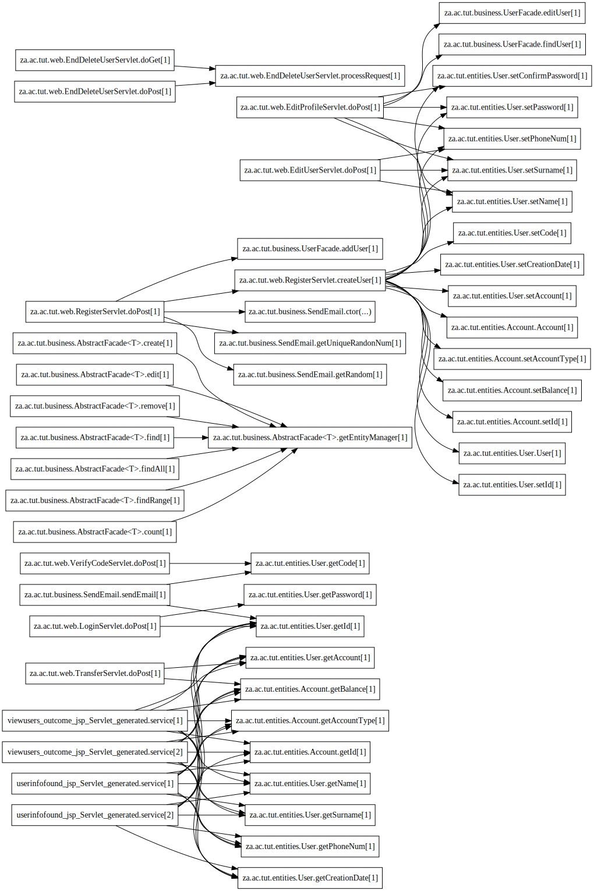

This more clearly shows how function calls flow within the application. Note that functions which do not call any other functions are not included in the graph further simplifying the output. This graph can also help to determine entrypoints into the application, visualise the most complicated code flows, and identify broken code flows that may be good candidates for shimming using WSIL code (see the [Bridging Analysis](#bridging-analysis) section).

To obtain a call graph which shows call interactions between functions which have either "account" or "user" in the names, for example, the following command can be used:

```
Command>  graph calls --filter=.*?account.*,.*?user.* --ignorecase
[+] Call graph written to file 'C:\wsast\latest\vba\graphs\calls.dot'
```

The graph produced follows:

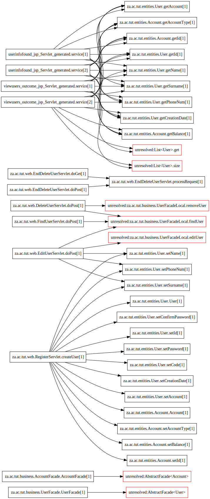


This type of call graph (focused around a specific chain of filters) can be very useful in determining call interactions between major groups of functionality, for example user/account/login/database interaction and can help visualise how such interactions fit together within the codebase. 

One **IMPORTANT** behaviour to bear in mind when graphing relationships with filters is that all nodes within the call graph must match the filters to be included. So for the graph above the `User.setName()` function appears to be called only by the `RegisterServlet.createUser()` and `EditUserServlet.doPost()` methods but may actually be called from other methods which do not match the current filters applied.

To resolve the issue of callers not matching filters it may be preferable to use the `--highlight` filter to colour specific functions and callers, allowing their positions in the larger call graph to be identified easily without excluding specific callers. For example:

```
Command>  graph calls --highlight=.*?account.*,.*?user.* --ignorecase
[+] Call graph written to file 'C:\wsast\latest\vba\graphs\calls.dot'
```

Resulting in:

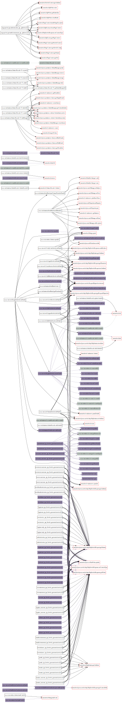

If the `User.setName()` function is zoomed in on, the callers can be seen a little more clearly:

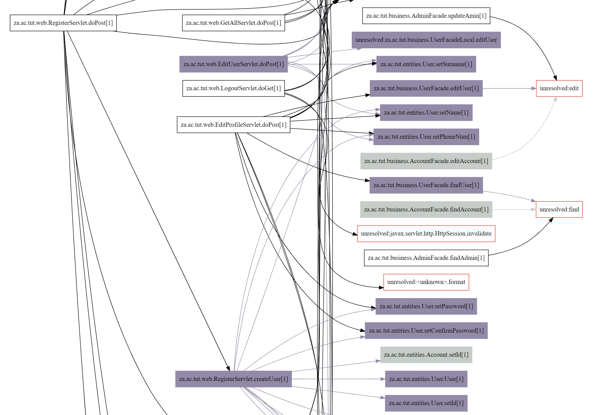

The missing `EditProfileServley.doPost()` caller is then observed.

Another useful graphing capability which is offered by the `graph calls` feature is the `--filter-root` parameter. This applies any specified `--filter` only to the root element of the call graph (i.e. the first call in the call chain), enabling all calls branching out from calls matching a specific filter to be graphed.

For example for all calls from any call with `RegisterServlet` in the name, the following command can be used:

```
Command>  graph calls --filter=.*?account.*,.*?RegisterServlet.* --filter-root
[+] Call graph written to file 'C:\wsast\latest\vba\graphs\calls.dot'
```

The following graph is produced:

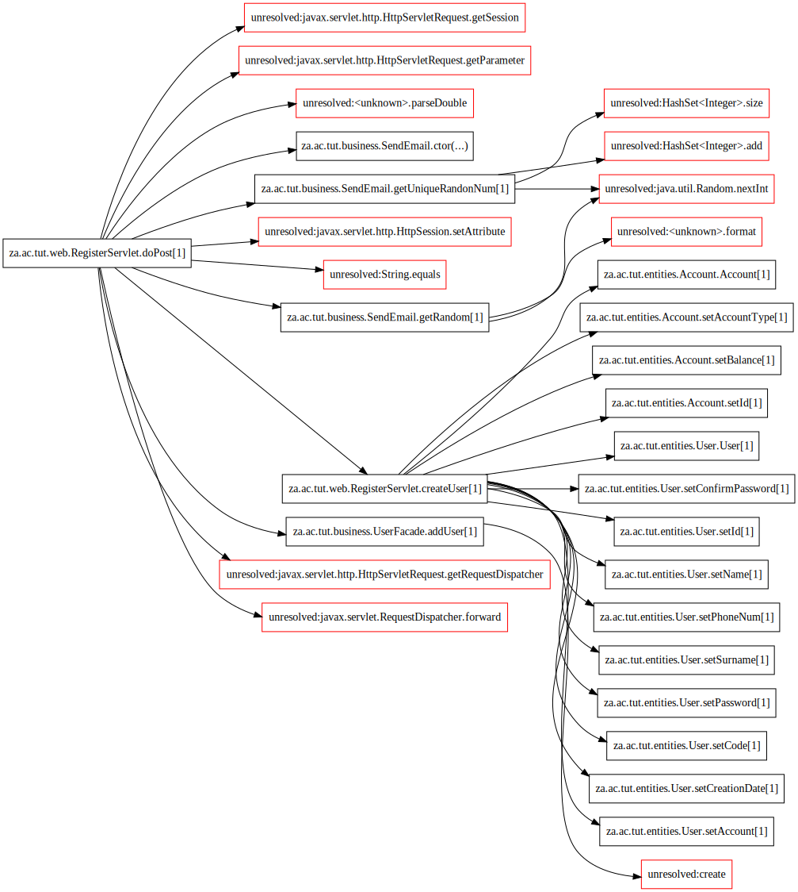

As observed only calls from "RegisterServlet" are included, but unlike with a plain filter on this term the functions called by this method need not contain "RegisterServlet".

### Searching Code
The wSAST `interactive` mode provides two methods for searching the code analysed; `kdbsearch` and `astsearch`. The `kdbsearch` performs a search of the code objects within the knowledge base and can filter by code object type (e.g. class, variable); the `astsearch` searches the WSIL trees corresponding to the source code and can filter based on tree node type, label or value.

An example of searching the knowledge base for variables containing "password" or variants thereof:

```
Command>  kdbsearch .*?\b(pass|passwd|password)\b.* v
VARIABLE     za.ac.tut.entities.Admin.password
    C:\wsast\examples\Voice_Banking_App-master\src\java\za\ac\tut\entities\Admin.java (line 25)

VARIABLE     za.ac.tut.entities.Admin.setPassword[1].password
    C:\wsast\examples\Voice_Banking_App-master\src\java\za\ac\tut\entities\Admin.java (line 43)

VARIABLE     za.ac.tut.entities.User.password
    C:\wsast\examples\Voice_Banking_App-master\src\java\za\ac\tut\entities\User.java (line 35)

VARIABLE     za.ac.tut.entities.User.setPassword[1].password
    C:\wsast\examples\Voice_Banking_App-master\src\java\za\ac\tut\entities\User.java (line 86)
...
```

The following type filters are provided: `[g]lobal, [n]amespace, [i]nterface, [cl]ass, [m]ethod, [co]nstructor, [b]lock, [v]ariable`.

The `astsearch` feature is generally most useful for two things. The first is for finding usage of specific types (as in built-in types like `int64` or user-defined types like classes):

```
Command>  astsearch .*?\bUser\b.* t
[TYPE ]  za.ac.tut.entities.User
    C:\wsast\examples\Voice_Banking_App-master\src\java\za\ac\tut\entities\User.java (line 25)

[TYPE ]  za.ac.tut.entities.User
    C:\wsast\examples\Voice_Banking_App-master\src\java\za\ac\tut\entities\User.java (line 46)
...
```

Which differs from the `kdbsearch` capability because the latter will just look for the type in the knowledge base rather than specific usage of the type.

The second is for finding literals within the source code, such as emails as in the below example:

```
Command>  astsearch ".*?@.*?\.[a-z]+" v
[VALUE]  "technologiesmart42@gmail.com"
    C:\wsast\examples\Voice_Banking_App-master\src\java\za\ac\tut\business\SendEmail.java (line 40)
```

These features are not especially useful when it comes to understanding the codebase but may have limited use.

### Determining Callers

#### Calls To
A useful feature of wSAST is the ability to list callers to and from specific methods based on a regex through the use of the `calls to` command. To use this feature a command such as the following can be executed:

```
Command>  calls to za.ac.tut.entities.User.setName\[1\]
call        za.ac.tut.entities.User.setName[1]
C:\...\examples\Voice_Banking_App-master\src\java\za\ac\tut\web\EditUserServlet.java (line 44)     METHOD      za.ac.tut.web.EditUserServlet.doPost[1]

call        za.ac.tut.entities.User.setName[1]
C:\...amples\Voice_Banking_App-master\src\java\za\ac\tut\web\EditProfileServlet.java (line 53)     METHOD      za.ac.tut.web.EditProfileServlet.doPost[1]

call        za.ac.tut.entities.User.setName[1]
C:\...amples\Voice_Banking_App-master\src\java\za\ac\tut\web\EditProfileServlet.java (line 76)     METHOD      za.ac.tut.web.EditProfileServlet.doPost[1]

call        za.ac.tut.entities.User.setName[1]
C:\...amples\Voice_Banking_App-master\src\java\za\ac\tut\web\EditProfileServlet.java (line 98)     METHOD      za.ac.tut.web.EditProfileServlet.doPost[1]

call        za.ac.tut.entities.User.setName[1]
C:\...amples\Voice_Banking_App-master\src\java\za\ac\tut\web\EditProfileServlet.java (line 119)    METHOD      za.ac.tut.web.EditProfileServlet.doPost[1]

call        za.ac.tut.entities.User.setName[1]
C:\...amples\Voice_Banking_App-master\src\java\za\ac\tut\web\EditProfileServlet.java (line 140)    METHOD      za.ac.tut.web.EditProfileServlet.doPost[1]

call        za.ac.tut.entities.User.setName[1]
C:\...\examples\Voice_Banking_App-master\src\java\za\ac\tut\web\RegisterServlet.java (line 110)    METHOD      za.ac.tut.web.RegisterServlet.createUser[1]
C:\...\examples\Voice_Banking_App-master\src\java\za\ac\tut\web\RegisterServlet.java (line 72)     METHOD      za.ac.tut.web.RegisterServlet.doPost[1]
```

This will output a comprehensive list of all callers to the specified method, and all paths in turn that these callers can be reached from. Since listing callers of callers can quickly lead to an explosion of results it is recommended that where this happens either the depth of the call stacks examined is limited by supplying an appropriate limit within the `--depth` parameter.

Due to the fact that the `calls to` command takes a regex filter it is possible to find all callers to any method within a specific class (for example):

```
Command>  calls to za.ac.tut.entities.User.set.*? --depth=1
call        za.ac.tut.entities.User.setName[1]
C:\...\examples\Voice_Banking_App-master\src\java\za\ac\tut\web\EditUserServlet.java (line 44)     METHOD      za.ac.tut.web.EditUserServlet.doPost[1]

call        za.ac.tut.entities.User.setPhoneNum[1]
C:\...\examples\Voice_Banking_App-master\src\java\za\ac\tut\web\EditUserServlet.java (line 45)     METHOD      za.ac.tut.web.EditUserServlet.doPost[1]

call        za.ac.tut.entities.User.setSurname[1]
C:\...\examples\Voice_Banking_App-master\src\java\za\ac\tut\web\EditUserServlet.java (line 46)     METHOD      za.ac.tut.web.EditUserServlet.doPost[1]

call        za.ac.tut.entities.User.setConfirmPassword[1]
C:\...amples\Voice_Banking_App-master\src\java\za\ac\tut\web\EditProfileServlet.java (line 52)     METHOD      za.ac.tut.web.EditProfileServlet.doPost[1]

call        za.ac.tut.entities.User.setName[1]
C:\...amples\Voice_Banking_App-master\src\java\za\ac\tut\web\EditProfileServlet.java (line 53)     METHOD      za.ac.tut.web.EditProfileServlet.doPost[1]
...
```

This lists only the immediate caller (depth of 1) to any function in the "User" class starting with "set".

The `--locs` parameter allows code to be printed inline to provide immediate context:

```
Command>  calls to za.ac.tut.entities.User.setName\[1\] --depth=1 --locs=1
call        za.ac.tut.entities.User.setName[1]
C:\...\examples\Voice_Banking_App-master\src\java\za\ac\tut\web\EditUserServlet.java (line 44)     METHOD      za.ac.tut.web.EditUserServlet.doPost[1]

[C:\...\examples\Voice_Banking_App-master\src\java\za\ac\tut\web\EditUserServlet.java (line 44)     +/- 1]

          user.setName(newName);
          user.setPhoneNum(newPhoneNum);

call        za.ac.tut.entities.User.setName[1]
C:\...amples\Voice_Banking_App-master\src\java\za\ac\tut\web\EditProfileServlet.java (line 53)     METHOD      za.ac.tut.web.EditProfileServlet.doPost[1]

[C:\...amples\Voice_Banking_App-master\src\java\za\ac\tut\web\EditProfileServlet.java (line 53)     +/- 1]
            user.setConfirmPassword(confirmPassword);
            user.setName(name);
            user.setPhoneNum(phoneNum);
...
```

#### Calls From
In addition to finding callers to a specific method, it is possible to find calls made from a specific method using the `calls from` command. This command also works based on a regex filter and can be used to find all calls from a specific class (for example) rather than just from a specific method.

To list calls from a specific method a command such as the following can be executed:

```
Command>  calls from za.ac.tut.web.TransferServlet.doPost\[1\]
C:\...\examples\Voice_Banking_App-master\src\java\za\ac\tut\web\TransferServlet.java (line 26)     METHOD      za.ac.tut.web.TransferServlet.doPost[1]
C:\...\examples\Voice_Banking_App-master\src\java\za\ac\tut\web\TransferServlet.java (line 30)     call        unresolved:javax.servlet.http.HttpServletRequest.getSession

C:\...\examples\Voice_Banking_App-master\src\java\za\ac\tut\web\TransferServlet.java (line 26)     METHOD      za.ac.tut.web.TransferServlet.doPost[1]
C:\...\examples\Voice_Banking_App-master\src\java\za\ac\tut\web\TransferServlet.java (line 33)     call        unresolved:javax.servlet.http.HttpServletRequest.getParameter

C:\...\examples\Voice_Banking_App-master\src\java\za\ac\tut\web\TransferServlet.java (line 26)     METHOD      za.ac.tut.web.TransferServlet.doPost[1]
C:\...\examples\Voice_Banking_App-master\src\java\za\ac\tut\web\TransferServlet.java (line 34)     call        unresolved:<unknown>.parseInt

C:\...\examples\Voice_Banking_App-master\src\java\za\ac\tut\web\TransferServlet.java (line 26)     METHOD      za.ac.tut.web.TransferServlet.doPost[1]
C:\...\examples\Voice_Banking_App-master\src\java\za\ac\tut\web\TransferServlet.java (line 34)     call        unresolved:javax.servlet.http.HttpServletRequest.getParameter

C:\...\examples\Voice_Banking_App-master\src\java\za\ac\tut\web\TransferServlet.java (line 26)     METHOD      za.ac.tut.web.TransferServlet.doPost[1]
C:\...\examples\Voice_Banking_App-master\src\java\za\ac\tut\web\TransferServlet.java (line 35)     call        unresolved:<unknown>.parseDouble
...
```

Similary to the `calls to` feature it is possible to restrict the depth of the call stacks created using the `--depth` parameter. This feature can often generate a substantial volume of results if the filter used matches a function at the root of a long code path.

### Determining Code Paths
One capability which could prove especially useful in understanding code flow is the `paths` command. This feature allows paths between code matching two provided regex filters to be listed. This feature can be used for example to find all paths between any code with "search" and "database", or "user" and "auth" to be listed.

The `paths` command takes two filters, for example to find any paths between the use of user "registration" classes and use of a "random" number generator class or method, the following command can be run:

```
Command>  paths .*?regist.* .*?random.* --ignorecase --locs=1
C:\wsast\examples\Voice_Banking_App-master\src\java\za\ac\tut\web\RegisterServlet.java (line 51)     METHOD      za.ac.tut.web.RegisterServlet.doPost[1]
C:\wsast\examples\Voice_Banking_App-master\src\java\za\ac\tut\business\SendEmail.java (line 88)     BLOCK       za.ac.tut.business.SendEmail.getUniqueRandonNum[1].[1].[1]
C:\wsast\examples\Voice_Banking_App-master\src\java\za\ac\tut\business\SendEmail.java (line 88)     call        unresolved:java.util.Random.nextInt

[C:\wsast\examples\Voice_Banking_App-master\src\java\za\ac\tut\business\SendEmail.java (line 88)     +/- 1]

     randomNum = rand.nextInt(99999999)+10;
      set.add(randomNum) ;

C:\wsast\examples\Voice_Banking_App-master\src\java\za\ac\tut\web\RegisterServlet.java (line 68)     METHOD      za.ac.tut.web.RegisterServlet.doPost[1]
C:\wsast\examples\Voice_Banking_App-master\src\java\za\ac\tut\business\SendEmail.java (line 28)     METHOD      za.ac.tut.business.SendEmail.getRandom[1]

[C:\wsast\examples\Voice_Banking_App-master\src\java\za\ac\tut\business\SendEmail.java (line 28)     +/- 1]

public String getRandom(){


C:\wsast\examples\Voice_Banking_App-master\src\java\za\ac\tut\web\RegisterServlet.java (line 68)     METHOD      za.ac.tut.web.RegisterServlet.doPost[1]
C:\wsast\examples\Voice_Banking_App-master\src\java\za\ac\tut\business\SendEmail.java (line 31)     METHOD      za.ac.tut.business.SendEmail.getRandom[1]
C:\wsast\examples\Voice_Banking_App-master\src\java\za\ac\tut\business\SendEmail.java (line 31)     call        unresolved:java.util.Random.nextInt

[C:\wsast\examples\Voice_Banking_App-master\src\java\za\ac\tut\business\SendEmail.java (line 31)     +/- 1]
    Random rand = new Random();
    int number = rand.nextInt(9999999);
```

As with the `calls` feature, the `--locs` parameter provides the ability to display a code listing and the `--depth` parameter allows the length of paths to be constrained.

## Automated Analysis

### General
There are certain common aspects of each of the above modes:

The `--sources` parameter specifies the path to the source code to be included for analysis. This parameter is a comma-separated list of files and folders to include or regular-expression of paths to exclude, for example `--sources=c:\src\folder1,c:\src\folder2,c:\src\file.java,!.*?test.*` will include all source code found (by recursively enumerating) within folders `c:\src\folder1` and `c:\src\folder2`, and explicitly include the single file `c:\src\file.java` too, but exclude any file or folder which matches the regular expression `.*?test.*` (the `!` prefix signifies that the specific 'path' is an exclusionary regex).

The `--project` parameter specifies the name of the project; this results in the creation of a folder with the name specified into which all outputs from wSAST analysis are stored. Two files which are always created following successful source analysis are `knowledgedb.txt` which contains the complete codebase structure as understood by wSAST and `entrypoints.txt` which contains all entrypoints into the code.

The entrypoints list may not be completely accurate as it will also include orphaned code (code with no callers) as well as code that wSAST could not deduce a caller for through control flow analysis but which may have an indirect caller (for example as an event handler from a framework wSAST has not been provided source or a shim for).

Each of the above modes begins with parsing and conversion to WSIL (the intermediate language over which analysis is performed), and the analysis steps described in the [Technical Overview](#technical-overview). Then the sources and sinks are loaded from the configuration and registered with the scan engine. Most frequently these sources and sinks will be implemented by the [Common Rules Engine](#common-rules-engine)

### Dataflow Analysis

The `dataflowscan` mode initiates a dataflow analysis scan. The scan performs source-to-sink analysis across all entrypoints identified within the target codebase. The scan is driven by the configuration specified within the `config.xml` file (see the [wSAST Configuration](#wsast-configuration) section) which dictates which languages are supported for analysis, where to find sources, sinks and subscribers for reporting, as well as general settings such as number of concurrent threads and guardrails for memory and execution time.

The dataflow analysis scan simulates execution starting from each entrypoint identified as described in section [Technical Overview](#technical-overview). The set of entrypoints from which a scan begins can be constrained by a series of regexes through the use of the `--filter` command-line parameter. This parameter provides a list of comma-separated case-insensitive regular expressions. If any one of the regular expressions matches the entrypoint path (the path being the fully qualified path to the code block contained within the knowledge database) then the entrypoint is included. If the regex begins with a `!` symbol then it is used to exclude the entry. So for example `--filter=.*?servlet.*,.*?handler.*,!.*?test.*` would include any entrypoint with a path containing 'servlet' or 'handler' as long as it did not also contain 'test'.

As dataflow analysis proceeds the output display takes one of two forms depending on the number of concurrent threads defined in the configuration. If one thread is defined then the dataflow analysis output is printed to the console as follows:

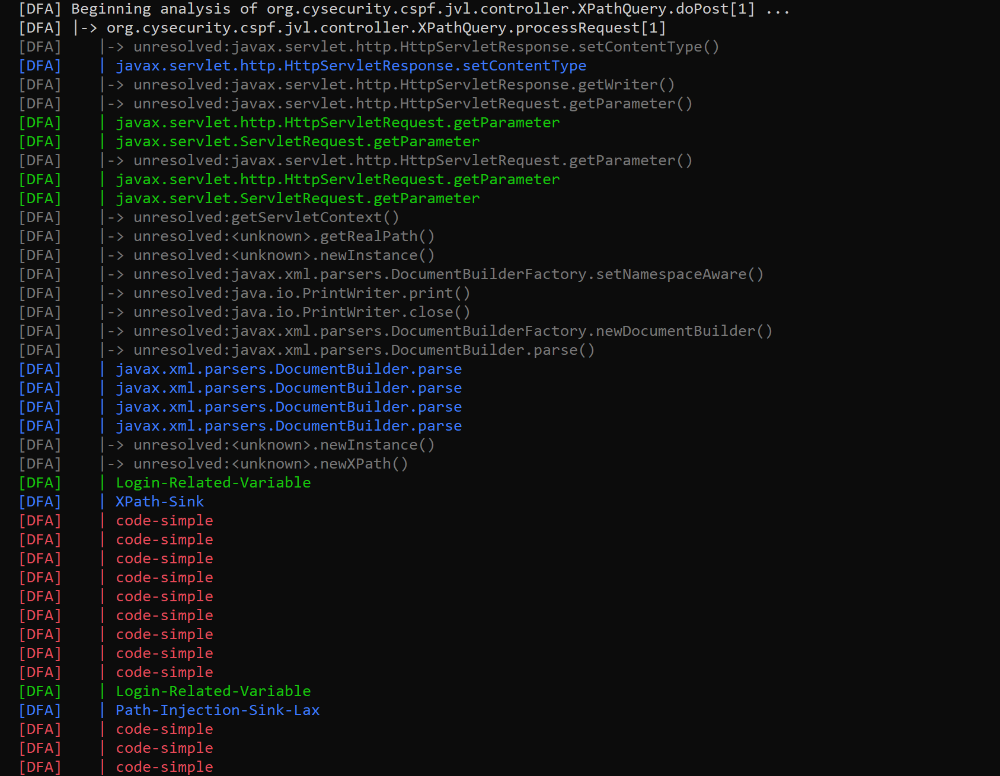

In the above the beginning and end of a path of analysis are printed in light grey, and any resolved functions which are called are also printed in light grey. Function calls which are made but for which source is not present or which could not be linked into the analysis path are printed in dark grey. Sources which match during execution are printed in green and sinks in blue. When a successful source-to-sink analysis is made and a subscriber is called to report on the issue then this is printed in red.

Often there will be multiple red subscriber results printed due to multiple traced variations of the finding or variables involved matching the same sink but usually only one finding will be logged by the default subscriber (contained within the Common Rules Engine) as it contains guardrails to prevent trivial variations of a finding from being repeatedly written.

If more than one thread is used then the console output is split into multiple columns, each of which represents an analysis thread. Calls are not printed by the display when in this mode to avoid excess screen clutter, but the beginning and end of a path of analysis are printed alongside any sources or sink matches, or subscriber calls:

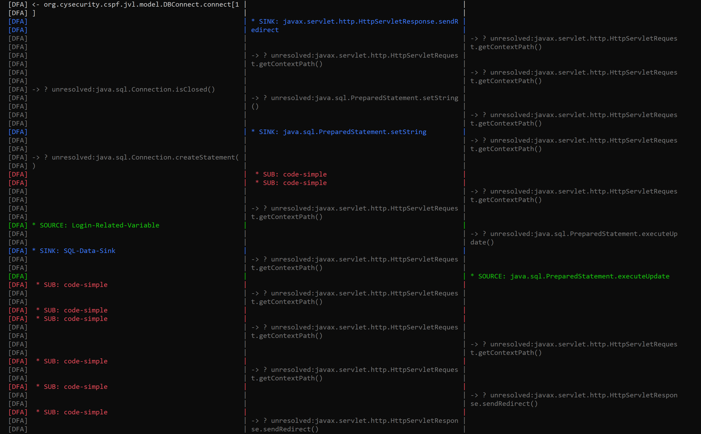

The console output may slightly slow analysis and may be safely redirected to `nul`; the console output as would have been displayed will still be recorded to a file named `wsastlog_yyyyMMdd.txt` inside the project directory.

Once the scan has completed - assuming the use of the Common Rules Engine implementation for source, sink and subscribers - a series of files should be created containing any findings. These are ordered by sink name by default:

```
22/01/2024  17:11             1,322 20240122_simple_java.security.MessageDigest.update.txt
22/01/2024  17:10             7,690 20240122_simple_java.sql.PreparedStatement.setString.txt
22/01/2024  17:11             7,004 20240122_simple_java.sql.Statement.executeQuery.txt
22/01/2024  17:11            32,265 20240122_simple_java.sql.Statement.executeUpdate.txt
22/01/2024  17:11            35,199 20240122_simple_java.util.Properties.setProperty.txt
22/01/2024  17:11             1,924 20240122_simple_javax.servlet.http.HttpServletResponse.addCookie.txt
22/01/2024  17:11             2,896 20240122_simple_javax.servlet.http.HttpServletResponse.sendRedirect.txt
22/01/2024  17:10             2,198 20240122_simple_javax.xml.xpath.XPath.compile.txt
22/01/2024  17:11             1,514 20240122_simple_Login-Related-Variable.txt
22/01/2024  17:11             2,114 20240122_simple_Path-Injection-Sink-Lax.txt
22/01/2024  17:11             1,148 20240122_simple_Secrets-Related-Variable.txt
22/01/2024  17:11            27,293 20240122_simple_SQL-Data-Sink.txt
22/01/2024  17:11             2,537 20240122_simple_XML-Or-HTML-Attribute-Injection-Sink.txt
22/01/2024  17:11             3,219 20240122_simple_XML-Or-HTML-Injection-Sink-Lax.txt
22/01/2024  17:11             2,109 20240122_simple_XPath-Sink.txt
```

An example of a findings entry follows:

```
----------------------------------------------------------------
Title: Insecure SQL Execution
Source-to-Sink: javax.servlet.http.HttpServletRequest.getParameter -> java.sql.Statement.executeQuery
Category: ALL_CATEGORIES
Source Description: Retrieves the value of a request parameter, potentially sourced from user input.
Sink Description: Executes an SQL query without proper validation, potentially exposing the application to SQL injection or incorrect execution.

[c:\wsast\examples\JavaVulnerableLab-master\src\main\java\org\cysecurity\cspf\jvl\controller\LoginValidator.java (line 44)]
          String pass=request.getParameter("password").trim();

[c:\wsast\examples\JavaVulnerableLab-master\src\main\java\org\cysecurity\cspf\jvl\controller\LoginValidator.java (line 47)]
                 Connection con=new DBConnect().connect(getServletContext().getRealPath("/WEB-INF/config.properties"));

[c:\wsast\examples\JavaVulnerableLab-master\src\main\java\org\cysecurity\cspf\jvl\model\DBConnect.java (line 23)]
    public Connection connect(String path) throws IOException,ClassNotFoundException,SQLException

[c:\wsast\examples\JavaVulnerableLab-master\src\main\java\org\cysecurity\cspf\jvl\model\DBConnect.java (line 25)]
        Properties properties=new Properties();

[c:\wsast\examples\JavaVulnerableLab-master\src\main\java\org\cysecurity\cspf\jvl\model\DBConnect.java (line 26)]
        properties.load(new FileInputStream(path));

[c:\wsast\examples\JavaVulnerableLab-master\src\main\java\org\cysecurity\cspf\jvl\model\DBConnect.java (line 27)]
        String dbuser=properties.getProperty("dbuser");

[c:\wsast\examples\JavaVulnerableLab-master\src\main\java\org\cysecurity\cspf\jvl\model\DBConnect.java (line 28)]
         String dbpass = properties.getProperty("dbpass");

[c:\wsast\examples\JavaVulnerableLab-master\src\main\java\org\cysecurity\cspf\jvl\model\DBConnect.java (line 29)]
       String dbfullurl = properties.getProperty("dburl")+properties.getProperty("dbname");

[c:\wsast\examples\JavaVulnerableLab-master\src\main\java\org\cysecurity\cspf\jvl\model\DBConnect.java (line 30)]
       String jdbcdriver = properties.getProperty("jdbcdriver");

[c:\wsast\examples\JavaVulnerableLab-master\src\main\java\org\cysecurity\cspf\jvl\model\DBConnect.java (line 31)]
            Connection con=null;

[c:\wsast\examples\JavaVulnerableLab-master\src\main\java\org\cysecurity\cspf\jvl\model\DBConnect.java (line 34)]
                    Class.forName(jdbcdriver);

[c:\wsast\examples\JavaVulnerableLab-master\src\main\java\org\cysecurity\cspf\jvl\model\DBConnect.java (line 35)]
                    con= DriverManager.getConnection(dbfullurl,dbuser,dbpass);

[c:\wsast\examples\JavaVulnerableLab-master\src\main\java\org\cysecurity\cspf\jvl\model\DBConnect.java (line 36)]
                    return con;

[c:\wsast\examples\JavaVulnerableLab-master\src\main\java\org\cysecurity\cspf\jvl\model\DBConnect.java (line 39)]
                    {

[c:\wsast\examples\JavaVulnerableLab-master\src\main\java\org\cysecurity\cspf\jvl\controller\LoginValidator.java (line 48)]
                    if(con!=null && !con.isClosed())

[c:\wsast\examples\JavaVulnerableLab-master\src\main\java\org\cysecurity\cspf\jvl\controller\LoginValidator.java (line 50)]
                                   ResultSet rs=null;

[c:\wsast\examples\JavaVulnerableLab-master\src\main\java\org\cysecurity\cspf\jvl\controller\LoginValidator.java (line 51)]
                                   Statement stmt = con.createStatement();  

[c:\wsast\examples\JavaVulnerableLab-master\src\main\java\org\cysecurity\cspf\jvl\controller\LoginValidator.java (line 52)]
                                   rs=stmt.executeQuery("select * from users where username='"+user+"' and password='"+pass+"'");
```

In its current implementation the Common Rules Engine does not implement any sanitizers and thus reports all possible findings.

### Static Analysis
The `staticscan` mode initiates a static analysis scan. The scan performs analysis of the codebase one WSIL tree at a time examining the tree structure based on a series of static rules each of which evaluates the tree structure in an attempt to identify possible vulnerabilities. The scan is driven by the configuration found within the `config.xml` file which dictates the languages to be analysed as well as the location of static rules.

The static analyser walks each WSIL tree within the project in succession from the tree root downwards to the leaves; for each node in the tree the static analyser checks whether the node type matches one expected by a registered static rule and if it does the rule is invoked. The rule can return a result object if a match is made which is then processed by the static subscribers to generate a report.

Similarly to the `dataflowscan` mode the WSIL tree node paths from which a scan is initiated can be constrained by a series of regexes through the use of the `--filter` command-line parameter. This parameter follows an identical format to the `--filter` parameter specified for the dataflow scan mode (comma separated regexes with a `!` prefix providing a negative filter).

As static anaysis proceeds the methods and constructors encountered are printed to the screen to show progress, however all nodes of the WSIL are actually analysed so the method name being printed is just to reflect progress. When a static rule is matched the match is printed to the console in red as follows:


The console output may slightly slow analysis and may be safely redirected to `nul`; the console output as would have been displayed will still be recorded to a file named `wsastlog_yyyyMMdd.txt` inside the project directory.

Once the scan has completed - assuming the use of the Common Rules Engine implementation for source, sink and subscribers - a series of files should be created containing any findings. These are ordered by sink name by default:

```
10/02/2024  17:49             1,311 20240210_static_simple_java.io.FileOutputStream.close.txt
10/02/2024  17:48               468 20240210_static_simple_java.security.MessageDigest.digest.txt
10/02/2024  17:48               972 20240210_static_simple_java.security.MessageDigest.update.txt
10/02/2024  17:48             2,093 20240210_static_simple_java.sql.PreparedStatement.setString.txt
10/02/2024  17:49             7,365 20240210_static_simple_java.sql.Statement.executeQuery.txt
10/02/2024  17:49             6,405 20240210_static_simple_java.sql.Statement.executeUpdate.txt
10/02/2024  17:49            43,226 20240210_static_simple_java.util.Properties.load.txt
10/02/2024  17:49             4,096 20240210_static_simple_java.util.Properties.setProperty.txt
10/02/2024  17:49             2,764 20240210_static_simple_java.util.Properties.store.txt
10/02/2024  17:48             2,182 20240210_static_simple_javax.servlet.http.HttpServletResponse.addCookie.txt
10/02/2024  17:48             5,593 20240210_static_simple_javax.servlet.http.HttpServletResponse.sendRedirect.txt
10/02/2024  17:49             1,646 20240210_static_simple_javax.servlet.http.HttpServletResponse.setContentLength.txt
10/02/2024  17:49             1,681 20240210_static_simple_javax.servlet.http.HttpServletResponse.setHeader.txt
10/02/2024  17:48             4,096 20240210_static_simple_javax.xml.parsers.DocumentBuilder.parse.txt
10/02/2024  17:48               501 20240210_static_simple_javax.xml.xpath.XPath.compile.txt
10/02/2024  17:48             2,001 20240210_static_simple_Login-Related-Variable.txt
10/02/2024  17:48               370 20240210_static_simple_Password-Related-Variable.txt
10/02/2024  17:49            25,387 20240210_static_simple_Path-Injection-Sink-Lax.txt
10/02/2024  17:48             1,227 20240210_static_simple_Secrets-Related-Variable.txt
10/02/2024  17:49               392 20240210_static_simple_Security-Related-Variable.txt
10/02/2024  17:49            10,689 20240210_static_simple_SQL-Data-Sink.txt
10/02/2024  17:49            24,640 20240210_static_simple_URL-Parameter-Injection-Sink.txt
10/02/2024  17:49           126,675 20240210_static_simple_XML-Or-HTML-Attribute-Injection-Sink.txt
10/02/2024  17:49           245,963 20240210_static_simple_XML-Or-HTML-Injection-Sink-Lax.txt
10/02/2024  17:49           100,396 20240210_static_simple_XML-Or-HTML-Injection-Sink.txt
10/02/2024  17:48               439 20240210_static_simple_XPath-Sink.txt
```

An example of a findings entry follows:

```
Rule: SQL-Data-Sink
Category: ALL_CATEGORIES
Description: Possible SQL injection due to string concatenation involving tainted inputs.
Source File: C:\wsast\examples\JavaVulnerableLab-master\src\main\java\org\cysecurity\cspf\jvl\controller\UsernameCheck.java (line 48)

                    rs=stmt.executeQuery("select * from users where username='"+user+"'");
```

## Common Rules Engine

### Overview
The Common Rules Engine component wSAST is the defacto implementation of the sources, sinks, static rules and subscribers used to scan source code; it operates as a plugin imported by the `config.xml` and provides a simple way of adding frequently required rule types (hence the name)

These common rules comprise several kinds of "simple" rules including `simplefunction` rules (reading potentially tainted data from functions, passing tainted data to dangerous functions), `simplevariable` rules (reading from/writing to variables matching a specific name, or implemented within a class or namespace matching a specific name), `simpledata` rules (reading data literals/writing or concatenating into data literals matching a specific regex), and for sources only `simpleannotation` rules which match annotation tags stored in the WSIL tree as strings.

The simple rules are all authored using an XML-based format which is read by the common rules engine. If operating wSAST in `interactive` mode the common rules configuration can be modified and reloaded between scans, allowing new rules to be added in real time and source code to be re-scanned as the project progresses.

The common rules engine also implements a handful of rules called `simplesyntactic` which relate to CWE-type issues which seek primarily to identify code which is semantically dubious, e.g. duplicated expressions where different expressions would be expected, order of evaluation issues. There are not many of these currently implemented but it is the plan that many more will be added as wSAST matures.

For more information on the format of the common rules XML entries please see the [Common Rules](commonrules.md) documentation.

### Function Rules
The `simplefunction` rule format allow for sources and sinks matching a specific function call expression to be matched as a dataflow or static rule.

An example of a function source rule follows:

```
<function name="javax.servlet.http.HttpServletRequest.getParameter" languages="java" categories="*" description="Retrieves the value of a request parameter, potentially sourced from user input.">
	<signature prefix-types=".*?HttpServletRequest.*" virtual="true" names="getParameter" param-count="1" />
	<param pos="1" name="name" types=".*?String" traced="false" trace-instance="true" />
	<return types=".*?String" virtual="true" traced="true" />
</function>
```

#### Function Tag
The `languages` attribute restricts the languages to which the rule applies (and must match the `name` element of the imported language within the wSAST config). The attribute is a comma-separated list of language names, or `*` to apply to all.

The `categories` attribute is a comma-separated list of values which are attached to the source match instance when a match is made and which are compared against any sink to which the traced match interacts; this can enable limitation of false positives.

For example two traced variables with two sources, one with a categories value of `MEM_CORRUPTION` and the other `SQL_INJECTION,XSS` reaching a sink with categories `XSS` would result in a subscriber call with the category set to `XSS` (which can be useful for classification when writing the result to file for example) for the variable tagged with a source with categories `SQL_INJECTION,XSS` but no result for the variable with only category `MEM_CORRUPTION`.

As a general rule of thumb it is best to leave categories as either a list of pertinent categories with `*` included, or just `*` to ensure all possible matches are made, and then to manually review the results to exclude invalid reports post-scan.

#### Signature Tag
The `signature` tag contains instructions on how to match the call expression in terms of the WSIL tree. The `prefix-types` attribute specifies a comma-separated list of regexes of the type names which should match the class type against which a method call is made.

For example if there is a class "CFoobar" then the `prefix-types` value could take `CFoobar` (a literal match), or if the full path to CFoobar is unknown or perhaps the source code is missing (in which case the class name would be prefixed with "unresolved:" then the regex `.*?CFoobar` would work, or if there is an entire family of classes with "Foo" or "Bar" or with in the name `.*?Foo.*,.*?Bar.*` can be used. If omitted then the prefix is not considered.

If the `virtual` attribute is set to true then the `prefix-types` regexes are matches up the inheritance hierarchy, allowing derived class instances with totally different names to still result in a match.

The `names` attribute is a comma-separated list of regexes which are used to match the function or method name. The `param-count` attribute contains a comma-separated list of the number of parameters that the function call should expect. This can also take a range of parameters such as `1-3,5,10-*` for example the call can take 1-3 parameters, or 5 exactly, or 10 or more parameters. Just supplying `*` allows any number of parameters.

For both `prefix-types` and `names` the `ignore-case` attribute can also be used.

As an example to match any function with "query" in the name belonging to a database class with an unknown name, you might have:

```
<signature prefix-types=".*?(db|database|sql|repo).*" ignore-case="true" virtual="true" names=".*?query.*" param-count="1-*" />
```

This would match `FooDB.doQuery()` or `UserRepository.QueryUser()` etc.

```
<signature prefix-types=".*?sql.*" ignore-case="true" virtual="true" names=".*" param-count="1-*" />
```

The above would match any function belonging to a class with `sql` in the name.

#### Param/Return Tags
To match specific function parameters the `param` and `return` tags can be used. The `param` tag has a `pos` attribute which determines the parameter index which is to be matched (starting with index `1` for the first parameter). The `name` attribute is only used to provide context to the rule report and is not matched against anything so any value can be used.

The `types` attribute is a comma-separated list of regexes against which the types of parameters are matched (working in a similar way to the `prefix-types` attribute supplied to the `function` tag). The `virtual` attribute specifies that the parameter types are virtual and the type hierarchy should be considered, and `ignore-case` also applies to type name matching.

The `traced` variable has two meanings depending on whether it is used on a parameter considered a source or a parameter considered a sink. In the source case it specifies that the parameter passed should be marked traced and have an associated source match attached, allowing uses of that parameter that interact with a sink later to be reported. In the sink case it specifies that the associated parameter should be a traced value for the sink to be considered as having matched.

The `trace-instance` attribute specifies that if the underlying method is matched then not only is the specific variable matched marked as traced (according to the value of the `traced` attribute) but so is the underlying class instance associated with the matched prefix. This typically would result in any other property or method accesses from the underlying class being considered traced.

The `return` tag works similarly to the `param` tag with the exception that it has no `pos` attribute and only applies to function sources (as a traced value can't be passed as a function return value). If a `return` tag is used then the return value from a function is traced (rather than parameter passed as input).

A final fairly powerful feature of the `param` and `return` tags is support for linked variable relationships. This feature allows two parameters that are marked as traced to be linked together, for example a buffer and the associated length variable. This relationship is maintained when the variables are copied around, modified etc. unless completely overwritten. Function sources can establish links and sinks can validate them.

The associated attribute is `linked-param`. An example of a parameter featuring this attribute could be:

```
<param pos="1" name="buffer" types="uint8\[\]" virtual="true" linked-param="return:BUFFER_FOR:LENGTH_OF" traced="true" />
```

The `linked-param` value has the format `<target param number or 'return'>:<relation of current param to the target param>:<reciprocal relationship>`. The value representing the relationship between parameters is an arbitrary value, so can be meaningful only in the context of a specific source or sink; in the example given the `linked-param` can be interpreted to mean the param 1 is linked to the return value and the relationship of param 1 is that it's the BUFFER_FOR the return value, and the return value is the LENGTH_OF param 1.

In a sink the corresponding `linked-param` would look like:

```
	<param pos="2" name="src" types="uint8\[\], *" traced="true" linked-param="3:BUFFER_FOR:"/>
	<param pos="3" name="len" types="int32, *" traced="true" linked-param="2:LENGTH_OF:"/>
```

In a sink the `linked-param` format is `<target param number for comparison>:<relation of current param to target>:` and the relationship between the variables passed as parameters to the function are validated against the specified relational values prior to a sink match being made.

One further attribute which can be set on the `param` tag is a `value` attribute; if this is provided as a regular expression (for example `value=".*?(MD5|SHA1).*"`) then for the parameter to be matched the specific value must be found somewhere within a value literal passed to the method call for this parameter (for example `"MD5"` or `alg + "/MD5/" + padding`).

#### Instance Tag
The `instance` is valid only for sink rules and takes the following form:

```
<instance traced="true" />
```

If this tag is found inside of the `function` tags and the `traced` attribute is set to `true` then for a sink match to be successfully made the underlying instance on which the method call is being made must have been marked traced (by a corresponding `trace-instance` attribute on an associated source, ordinarily).

#### Static Rules

Static function rules operate through the same rule format as sinks with the exception that only the type and format matching is performed, no traced variable or linked parameter comparison is made as this only applies to dataflow variables.

#### Additional Controls
There are a number of controls which globally control how all function rules are matched, to relax certain requirements increasing the likelihood of a source or sink match being made. These allow prefix (`relax-prefix-types`) and param type (`relax-param-types`) matching to be relaxed, and for sinks linked params to be relaxed (`relax-linked-params`), and the requirement that all params are matched (`relax-match-all-params`) to be relaxed.

The `relax-match-all-params` option should generally be enabled because for example with the following rule:

```
<function name="java.nio.file.Files.copy" languages="java" report="true" categories="*" title="Insecure File Copy" description="Copies a file without proper validation, potentially allowing unauthorized or unsafe file operations.">
    <signature prefix-types=".*?Files" virtual="true" names="copy" param-count="3"/>
	<param pos="1" name="source" types=".*?Path" traced="true" />
	<param pos="2" name="target" types=".*?Path" traced="true" />
	<param pos="3" name="options" types=".*?CopyOption"  />
</function>
```

If the `relax-match-all-params` is set to false then both the "source" and "target" params must be traced for a sink match to result; a traced "target" parameter only would not trigger a match.

A useful control for the static rules is `traced-as-dynamic` which prevents a match occurring if none of the parameters are "dynamic" inputs (inputs other than literals), for example local variables, expressions (e.g. `"foo" + input`), etc. which helps reduce false positives.

For more information on the format of the `simplefunction` rule type please see the [Common Rules](commonrules.md#function/method-rules) section.

### Variable Rules
The `simplevariable` rule format allow for sources and sinks matching a specific variable access to be matched as a dataflow or static rule.

An example of a variable source rule follows:

```
<variable name="Session-Related-Variable" languages="*" categories="*" description="Possible read of sensitive session related variable." >
	<definition prefix-types=".*?http.*" prefix-virtual="true" types="string\[\]" virtual="false" names=".*?(session|cookie).*" access="read" traced="true" ignore-case="true" trace-instance="true" />
</variable>
```

#### Variable Tag
The `variable` tag `language` and `categories` attributes work in an identical way to their function rule analogues. The `description` and `name` attributes are used for reporting.

#### Definition Tag
The `definition` tag contains instructions on how to match variable usage as sources or sinks. The variable rules enable code accessing or setting variables, instance data members, or similar properties to be treated as sources or sinks.

The `prefix-types` attribute specifies a comma-separated list of regexes of the type names which should match the class type against which any member variable should be matched (this option can be omitted to not restrict to member variables). The `prefix-virtual` attribute specifies whether the inheritance hierarchy should be searched to match the prefix types. In the example given above the variable must be a data member of a class containing "http" in the name for a match to be considered.

The `types` attribute allows for the underlying type of the variable identified to be matched against a comma-separated list of regular expressions. The types attribute value relates to the underlying variable type rather than any specific class implementing it (as opposed to the prefix-types). In the example given above only `string[]` types are considered but any regexes can be used for more permissing matching. The `virtual` attribute allows the variable type matching to be performed up the inheritance hierarchy.

The `names` attribute specifies a comma-separated list of regexes which can be used to identify the name of the variable; for example, `.*?(session|cookie).*` to match common session and cookie variables of the type specified in the `types` attribute and a member of the class matching the `prefix-types` classes (if supplied).

The `access` attribute specifies the operation to be considered, either `read`, `write` or both (`read,write`); typically a source variable would be read from (`read`) and a sink variable would be written to `write`.

The `traced` attribute specifies for source variables that any sources derived from matching the variable rule should be marked `traced` and for a sink variable that for a match to occur the corresponding input variable or expression should be marked as traced.

The `trace-instance` attribute specifies that if the underlying variable is matched then not only is the specific variable matched marked as traced (according to the value of the `traced` attribute) but so is the underlying class instance associated with the matched prefix. This typically would result in any other property or method accesses from the underlying class being considered traced. For a variable sink the `trace-instance` attributes that the underlying class instance was marked as trace for a sink match to be made.

#### Static Rules

Static variable rules operate through the same rule format as variable sinks with the exception that only the type and format matching is performed, no traced variable comparison is made as this only applies to dataflow variables.

#### Additional Controls
There are a number of controls which globally control how all variable rules are matched, to relax certain requirements increasing the likelihood of a source or sink match being made. The only rule control for source and sink variable rules at the moment is `relax-prefix-types` which allows prefix type matching to be relaxed so any prefix type will match.

A useful control for the static rules is `traced-as-dynamic` which prevents a match occurring if none of the components in the matching expressions are "dynamic" inputs (inputs other than literals), for example local variables, expressions (e.g. `"foo" + input`), etc. which helps reduce false positives.

For more information on the format of the `simplevariable` rule type please see the [Common Rules](commonrules.md#variable/data-member-rules) section.

### Data Rules
The `simpledata` rule format allow for sources and sinks matching a specific data literal expression to be matched as a dataflow or static rule.

An example of a data source rule follows:

```
<data name="XPath-Sink" languages="*" categories="*" report="true" title="XPath Injection" description="Possible XPath/XQuery injection due to string concatenation involving tainted inputs.">
	<definition types=".*" value="\s*/.*?\[.*?(=\s*['&quot;]|<|>)" traced="true" ignore-case="true" />
</data>
```

#### Data Tag
The `data` tag `language` and `categories` attributes work in an identical way to their function rule analogues. The `description` and `name` attributes are used for reporting.

#### Definition Tag
The `definition` tag contains instructions on how to match data literals as sources or sinks. The data rules enable code which inlines specific data literals to taint any expressions into which they are assigned to be marked as sources, and  and expressions into which they are concatenated to be sinks.

The `types` attribute allows for the underlying type of the data literal to be matched against a comma-separated list of regular expressions. Since the WSIL languages only supports a very limited set of built-in types (such as `int32`, `uint64`, `string` and associated arrays of these types this field is not especially useful and is best left to match all types (`.*`).

The `values` attribute represents a comma-separated list of regexes which are used to match the data literal comprising the source or the sink.

The `traced` attribute specifies for source data literal that any sources derived from matching the rule should be marked `traced` and for a sink data literal that for a match to occur the corresponding input variable or expression should be marked as traced.

#### Static Rules
Static data rules operate through the same rule format as data sinks with the exception that only the type and value matching is performed, no traced variable comparison is made as this only applies to dataflow variables.

#### Additional Controls
There are a number of controls which globally control how all data rules are matched, to relax certain requirements increasing the likelihood of a source or sink match being made. The only rule control for source and sink data rules at the moment is `relax-prefix-types` which allows prefix type matching to be relaxed so any prefix type will match.

A useful control for the static rules is `traced-as-dynamic` which prevents a match occurring if none of the components in the matching expressions are "dynamic" inputs (inputs other than literals), for example local variables, expressions (e.g. `"foo" + input`), etc. which helps reduce false positives.

Since a lot of code includes fairly lengthy embedded string literals (especially within generated code) the Common Rules Engine control `regex-timeout` should generally be set to a low value if making extensive use of data rules. This can also help mitigate poorly written data rule regular expressions from impacting scan time too significantly should any exist.

For more information on the format of the `simpledata` rule type please see the [Common Rules](commonrules.md#data-rules) section.

### Annotation Rules
The `simpleannotation` rule format allow for sources matching a specific annotation to be matched as a dataflow rule. At present annotation-based sinks are not supported.

An example of an annotation source rule follows:

```
<annotation name="GetMappingAnnotationSource" languages="java" categories="*" description="Annotation for mapping HTTP GET requests onto specific handler methods.">
    <definition scope="method" value=".*?(GetMapping).*" action="taint" ignore-case="false" />
</annotation>
```

#### Annotation Tag
The `annotation` tag `language` and `categories` attributes work in an identical way to their function rule analogues. The `description` and `name` attributes are used for reporting.

#### Definition Tag
The `definition` tag contains instructions on how to match annotation rules. The annotation rules enables specification of annotations attached to any WSIL tree node to be considered sources; a common use for annotations in code is to mark user-supplied classes, parameters or fields, or mark specific functions as entrypoints (where parameters are implied to be user-controlled).

The `scope` tag specifies the type of code object to which the annotation is applied; this can take values such as `class`, `method`, and `variable`.

The `value` parameter is a single regex which specifies the value which the annotation should take for a match to be considered valid; in the example above the value of `.*?(GetMapping).*` would match an annotation such as:

```
@GetMapping("/owners/{ownerId}/pets/{petId}")
public Pet findPet(@PathVariable Long ownerId, @PathVariable Long petId) {
	// ...
}
```

The `action` parameter specifies which variables are tainted when a match occurs; `taint` generally taints the immediate variable which was annotated (data members if matching a class, or parameters if matching a method type); `taint-instance` which taints the associated class instance; `taint-members` which taints the data members of a class whenever a match occurs.

For more information on the format of the `simpleannotation` rule type please see the [Common Rules](commonrules.md#annotation-rules) section.

### Syntactic Rules
The `simplesyntactic` rules can be enabled within the wSAST configuration XML (`config.xml`) under the `sink` or `static` sections; these provide a (**heavily work in progress**) implementation of some commonly encountered programming errors arising from coding errors such as copy+pasted code which was not correctly updated leading to redundant conditions, operator precedence errors, duplicated conditionals.

Only a small number of rules have been implemented so far. These include `AssignmentInsideConditionRule`, `DuplicatedIfElseConditionRule` `DuplicatedLogicalExpressionRule`, `DuplicatedTernaryExpressionRule`, and several others. These detect code such as:

```
if (a = b) { ... } // AssignmentInsideConditionRule
if (a == b) { ... } else if (a == b) { ... } // DuplicatedIfElseConditionRule
bool foo = (a == b) || (a == b) // DuplicatedLogicalExpressionRule
bool foo = a ? b : b // DuplicatedTernaryExpressionRule
```

The code implementing the `DuplicatedIfElseConditionRule` (for illustrative purposes) is as follows:

```
	protected override bool CheckStaticRule(WrappedWsilNode node)
	{
		if (node.GetName() != "if")
		{
			return false;
		}
		
		var ifElseStatementChainConditions = ASTHelpers.GetIfElseStatementChainConditions(node);
		
		if (ifElseStatementChainConditions.Count < 2)
		{
			return false;
		}
		
		var array = ifElseStatementChainConditions.DifferentCombinations(2).ToArray();
		
		foreach (IEnumerable<WrappedWsilNode> source in array)
		{
			var node2 = source.ElementAt(0);
			var node3 = source.ElementAt(1);
			
			if (ASTHelpers.CompareExpressions(node2, node3))
			{
				return true;
			}
		}
		
		return false;
	}
```

When enabled as sink rules the `simplesyntactic` rules are reported when a tainted variable interacts with a syntactic error sink during a dataflow scan; when enabled as static rules all instances discovered during a static scan are reported.

These rules can be individually toggled within the `commonrules.xml` configuration. For more information on the rules currently available please see the [Common Rules](commonrules.md#semantic-syntactic-rules) section.

### Subscribers
The Common Rules Engine provides two simple output subscribers by default. These output each finding as a text file entry and report the finding title, source, sink or static description, and capture the relevant code traces. By default these are written into separate text files separated by sink or static rule name.

#### Simple Subscriber (Dataflow)
The following is the default subscriber for dataflow analysis:

```
	<simple-subscriber>
		<subscriber type="code-simple" log-to="{date}_simple_{sink-name}.txt" categories="*" allow-dups="false" full-path="true" />
	</simple-subscriber>
```

The `type` attribute specifies the output type; `code-simple` is the only valid one at present which outputs to a text file.

The `log-to` attribute defines the filename of the output files; valid fields include:

* `{date}` - the current date in yyyyMMdd format
* `{category}` - the category associated with the source/sink match
* `{source-name}` - the name associated with the source rule that was matched
* `{sink-name}` - the name associated with the sink rule that was matched
* `{source-file}` - the file name of the file the source match occurred in (just the filename, not full path)
* `{sink-file}` - the file name of the file the sink match occurred in (just the filename, not full path)
* `{language}` - the programming language the sink match occurred in

The `allow-dups` field prevents duplicate findings from occurring (for example where two dataflow traces traverse the same partial code path reporting a finding twice); the `full-path` setting ensures that every line between the source and the sink is reported, otherwise only the source and sink line is reported.

#### Simple Subscriber (Static)
```
	<static-subscriber>
		<subscriber type="code-simple" log-to="{date}_static_simple_{rule-name}.txt" categories="*" allow-dups="false" />
	</static-subscriber>
```

## Creating Rules with ChatGPT
It is possible to use ChatGPT to create rules; to do this the XML format needs to be described to ChatGPT, and then new rules need to be requested in XML form. The recommended prompt can be found in the [Common Rules](commonrules.md#chatgpt-based-creation-of-xml-rulesets) section.

A simple Python script is also provided on the wSAST GitHub [rulegen](https://github.com/wsast/rulegen) repo. which can be used to generate rules from a list of class names. To use this typically wSAST should be run with the `--logci` flag which will write all unresolved imports to the file `unres-imports.txt` and then GPT can be used to sort the (sanitised, if proprietary) list of class names into possible sources and sinks:

Example prompt:
```
I am performing a security code review of some Java code. The application uses the following classes. Please sort them into two lists: SOURCES (those classes which may potentially produce or represent some form of user-supplied input such as a web request, file, or serialized data), and SINKS (those classes which contain methods which may result in dangerous behaviours if untrusted input is processed). Include classes which can be both in both lists; ignore classes which are neither. Please output lists with no commentary or additional  detail:

java.io
java.io.BufferedWriter
java.io.DataInputStream
java.io.File
java.io.FileInputStream
java.io.FileOutputStream
java.io.FileWriter
java.io.InputStream
java.io.IOException
java.io.PrintWriter
java.security.MessageDigest
java.security.NoSuchAlgorithmException
java.sql.Connection
java.sql.DriverManager
java.sql.PreparedStatement
java.sql.ResultSet
java.sql.ResultSetMetaData
java.sql.SQLException
java.sql.Statement
java.util
java.util.List
java.util.Properties
javax.servlet.http.Cookie
javax.servlet.http.HttpServlet
javax.servlet.http.HttpServletRequest
javax.servlet.http.HttpServletResponse
javax.servlet.http.HttpSession
javax.servlet.RequestDispatcher
javax.servlet.ServletException
javax.xml.parsers.DocumentBuilder
javax.xml.parsers.DocumentBuilderFactory
javax.xml.xpath.XPath
javax.xml.xpath.XPathFactory
org.hibernate.cfg.Configuration
org.hibernate.Query
org.hibernate.Session
org.hibernate.SessionFactory
org.json.JSONObject
org.w3c.dom.Document
org.w3c.dom.Element
org.w3c.dom.NodeList
org.xml.sax.InputSource
```

The response should be close to:

```
SOURCES:
java.io.DataInputStream
java.io.File
java.io.FileInputStream
java.io.InputStream
java.sql.Connection
java.sql.DriverManager
java.sql.ResultSet
java.sql.ResultSetMetaData
java.sql.Statement
java.util.Properties
javax.servlet.http.Cookie
javax.servlet.http.HttpServletRequest
javax.servlet.http.HttpSession
javax.xml.parsers.DocumentBuilder
javax.xml.parsers.DocumentBuilderFactory
javax.xml.xpath.XPath
javax.xml.xpath.XPathFactory
org.hibernate.Query
org.hibernate.Session
org.hibernate.SessionFactory
org.json.JSONObject
org.w3c.dom.Document
org.w3c.dom.Element
org.w3c.dom.NodeList
org.xml.sax.InputSource

SINKS:
java.io.BufferedWriter
java.io.DataInputStream
java.io.File
java.io.FileOutputStream
java.io.FileWriter
java.io.IOException
java.io.PrintWriter
java.security.MessageDigest
java.sql.Connection
java.sql.PreparedStatement
java.sql.SQLException
java.sql.Statement
javax.servlet.http.HttpServletResponse
javax.servlet.RequestDispatcher
javax.servlet.ServletException
javax.xml.xpath.XPath
org.hibernate.Query
org.hibernate.Session
org.hibernate.SessionFactory
org.json.JSONObject
```

These two lists should be saved to files `jvl-sources.txt` and `jvl-sinks.txt` and then the `rulegen.py` script can be run. Running `rulegen.py source jvl-sources.txt` should populate a folder `sources\` with XML files containing rules for each of the above, and running `rulegen.py sink jvl-sinks.txt` for sinks will do similarly.

The source rules then need to be copied into the wSAST installation directory `rules\java\function\sources\gpt` folder, and must be added as imports into the `rules\java\function\java-gpt-sources.xml` file (and similary for sinks).

Using wSAST this way allows for quick and easy tailoring to a specific codebase.
